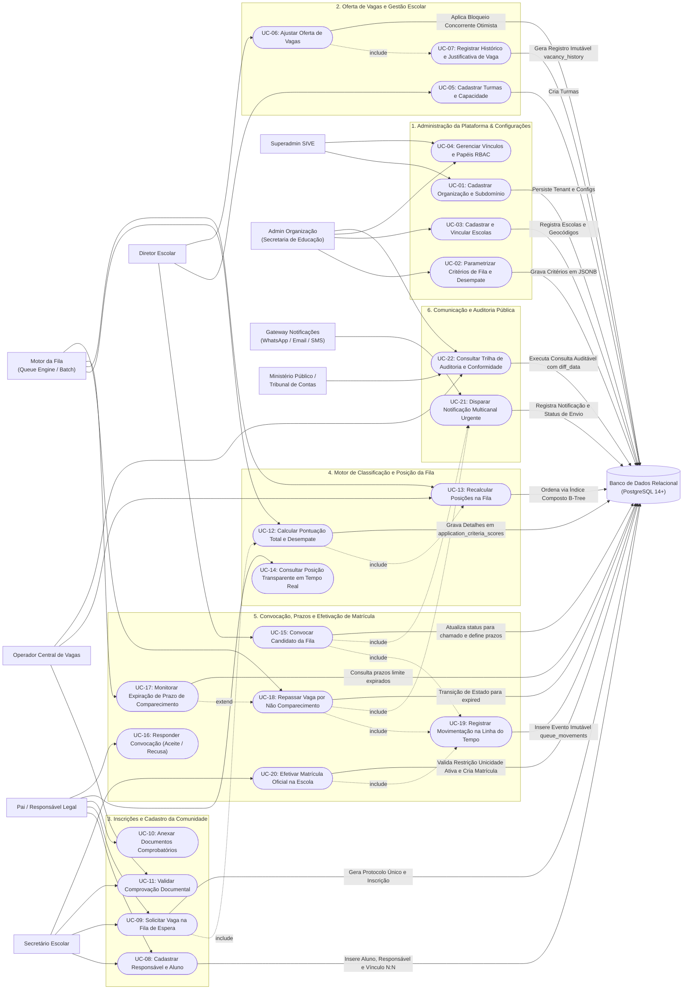

# SIVE — Diagrama de Casos de Uso (UML Use Case Specification)
**Especificação Funcional, Engenharia de Requisitos e Interação com Banco de Dados**  
*Sistema Integrado de Vagas Escolares (SIVE)*  
*Versão:* 1.0 · *Data:* Outubro de 2026 · *Arquitetura:* Multi-tenant SaaS · Spring Boot & PostgreSQL  

---

## 1. Visão Geral dos Atores do Sistema

No SIVE, os casos de uso abrangem tanto os **Atores Humanos** (usuários com diferentes papéis de acesso no modelo RBAC e a comunidade escolar) quanto os **Atores de Sistema / Infraestrutura**, com ênfase primordial no **Banco de Dados Relacional (PostgreSQL)** como agente garantidor da integridade transacional, unicidade e imutabilidade auditável.

```
                           MAPA DE ATORES DO ECOSSISTEMA SIVE

       ┌────────────────────────────── ATORES HUMANOS ──────────────────────────────┐
       │                                                                            │
       │   [Superadministrador SIVE]      [Administrador da Organização (Prefeitura)]│
       │              │                                     │                       │
       │   [Operador da Central de Vagas]          [Diretor / Gestor Escolar]       │
       │              │                                     │                       │
       │   [Secretário / Atendente Escolar]        [Pai / Responsável Legal]        │
       │                                                                            │
       └─────────────────────────────────────┬──────────────────────────────────────┘
                                             │ Interage via API Spring Boot
                                             ▼
       ┌──────────────────── ATORES DE SISTEMA & INFRAESTRUTURA ────────────────────┐
       │                                                                            │
       │   [⚡ Motor da Fila (Queue Engine)]     [📱 Gateway de Notificações]       │
       │   Recálculo de notas e monitoramento     WhatsApp, SMS, E-mail e Push      │
       │   de expiração de prazos                 multicanal                        │
       │                                                                            │
       │   [⚖️ Órgãos de Controle Externo]        [🗄️ Banco de Dados PostgreSQL]    │
       │   Ministério Público / Tribunal de       Controle ACID, integridade FK,    │
       │   Contas (Auditoria)                     índices B-Tree e lock concorrente │
       │                                                                            │
       └────────────────────────────────────────────────────────────────────────────┘
```

### 1.1. Detalhamento dos Atores

| Categoria | Ator | Descrição e Responsabilidades |
|---|---|---|
| **Humano (SaaS)** | **Superadministrador SIVE** | Gestor global da infraestrutura SaaS (`sive_super_admin` / `sive_admin`). Cadastra organizações (prefeituras e redes privadas), define limites contratuais e monitora telemetria global. |
| **Humano (Rede)** | **Administrador da Organização** | Gestor do órgão central (`org_admin` - ex.: Secretário Municipal de Educação ou Diretor de Rede de Ensino). Configura critérios de pontuação da fila, critérios de desempate, vincula escolas e emite relatórios globais de demanda. |
| **Humano (Rede)** | **Operador da Central de Vagas** | Técnico da central de atendimento (`org_operator`). Realiza remanejamentos entre unidades, valida comprovações documentais pendentes e cadastra ordens judiciais / tutelas de urgência. |
| **Humano (Escola)** | **Gestor Escolar / Diretor** | Diretor da unidade escolar (`school_admin`). Configura turmas e capacidades, realiza ajustes de vagas abertas com justificativa obrigatória e autoriza convocações de candidatos. |
| **Humano (Escola)** | **Secretário / Atendente Escolar** | Operador da secretaria escolar (`school_staff`). Realiza atendimento presencial no balcão, efetua o cadastro inicial de alunos e responsáveis sem acesso digital e formaliza matrículas. |
| **Humano (Comunidade)** | **Pai / Responsável Legal** | Usuário externo (`guardians`). Solicita vagas na fila de espera para seus dependentes, envia comprovantes socioeconômicos, acompanha a posição transparente em tempo real e responde a convocações. |
| **Sistema** | **Banco de Dados (PostgreSQL)** | **Ator de infraestrutura transacional ativo**. Garante conformidade ACID, isolamento multi-tenant por FK, integridade referencial, concorrência segura (`@Version`), ordenação de alta performance por índice composto e imutabilidade de logs. |
| **Sistema** | **Motor de Regras e Fila (Queue Engine)** | Agendador e processador em segundo plano (Spring Scheduled / Event Bus). Dispara recálculos em lote de notas da fila, verifica expiração de prazos (`callDeadlineAt`) e avança a fila automaticamente. |
| **Sistema** | **Gateway de Notificações** | Subsistema multicanal assíncrono. Dispara comunicados de convocação urgente, atualizações de posição e confirmações de matrícula via WhatsApp, SMS, E-mail e Push. |
| **Externo** | **Órgãos de Controle (Ministério Público)** | Entidade fiscalizadora de transparência pública. Consulta trilhas de auditoria imutáveis, histórico de movimentação de alunos e justificativas de abertura de vagas. |

---

## 2. Diagrama de Casos de Uso Completo (Mermaid)

O diagrama abaixo modela todos os atores, pacotes de casos de uso e as relações de `<<include>>`, `<<extend>>` e associações com o **Banco de Dados PostgreSQL**:



---

## 3. Especificação Detalhada dos Casos de Uso

Abaixo estão detalhados os principais casos de uso, descrevendo os fluxos de trabalho, regras de negócio e a participação direta do **Banco de Dados PostgreSQL**.

---

### Módulo 1: Gestão de Vagas e Turmas Escolares

#### `UC-06: Ajustar Oferta de Vagas da Turma`
- **Atores Primários:** Diretor Escolar (`SchoolAdmin`), Operador da Central de Vagas (`OrgOperator`).
- **Ator Secundário:** Banco de Dados Relacional (`PostgreSQL`).
- **Pré-condições:** Turma cadastrada e ativa (`status_id = 'open'`), usuário autenticado com permissão escolar.
- **Fluxo Principal:**
  1. O Diretor seleciona a turma e informa a nova quantidade de vagas disponíveis.
  2. O sistema calcula a variação (`variation = new_vacancies - previous_vacancies`).
  3. O Diretor é obrigado a redigir uma justificativa detalhada (ex.: "Abertura de nova sala física no bloco B" ou "Redução por transferência de professor").
  4. O sistema dispara `UC-07` (`<<include>>`).
  5. Se houver acréscimo de vagas (`variation > 0`), o sistema verifica se há candidatos em espera e aciona o `UC-15: Convocar Candidato da Fila`.
- **Interação com o Banco de Dados (PostgreSQL):**
  - **Transação ACID:** Executada sob isolamento `@Transactional`.
  - **Bloqueio Otimista (`@Version`):** Verifica o campo `version` em `school_classes` para impedir que outro operador altere a capacidade simultaneamente.
  - **Restrição de Integridade:** `CHECK (available_vacancies >= 0)` e `available_vacancies <= total_capacity`.
  - **Persistência Imutável:** Insere linha em `vacancy_history` vinculando o `user_id` do operador autenticado.

---

### Módulo 2: Inscrições e Motor de Fila

#### `UC-09: Solicitar Vaga na Fila de Espera`
- **Atores Primários:** Pai / Responsável Legal (`Guardian`) ou Secretário Escolar (`SchoolStaff` via balcão).
- **Atores Secundários:** Motor da Fila (`QueueEngine`), Banco de Dados (`PostgreSQL`).
- **Pré-condições:** Aluno e responsável cadastrados no sistema; aluno em idade compatível com a etapa da turma.
- **Fluxo Principal:**
  1. O solicitante escolhe a escola, ano letivo e turno desejados.
  2. Informa os dados comprobatórios para avaliação dos critérios (distância até a escola, benefício social, mãe solo, irmão matriculado na escola).
  3. O sistema gera automaticamente um protocolo público único (ex.: `SIVE-2026-SP-004812`).
  4. O sistema invoca `UC-12: Calcular Pontuação Total e Desempate` (`<<include>>`).
  5. O sistema insere a inscrição com status inicial `waiting`.
  6. O sistema invoca `UC-13: Recalcular Posições na Fila` (`<<include>>`).
  7. O protocolo e a posição calculada são entregues ao responsável.
- **Interação com o Banco de Dados (PostgreSQL):**
  - **Chave Única:** Valida a restrição `uq_student_school_class UNIQUE (student_id, school_id, school_class_id)` impedindo duplicidade de inscrição para a mesma turma.
  - **Georreferenciamento:** Calcula a distância geodésica entre `guardians.latitude/longitude` e `schools.latitude/longitude` gravando em `calculated_distance_meters`.
  - **Detalhamento Auditável:** Grava uma linha em `application_criteria_scores` para cada critério configurado pela organização.

---

#### `UC-13: Recalcular Posições na Fila de Espera`
- **Ator Primário:** Motor de Regras e Fila (`QueueEngine` / Background Job).
- **Ator Secundário:** Banco de Dados Relacional (`PostgreSQL`).
- **Gatilho:** Inserção de nova inscrição (`UC-09`), homologação de documentos que alteram pontos (`UC-11`), ou desistência formal (`UC-16`).
- **Fluxo Principal:**
  1. O motor seleciona todas as solicitações ativas com status `waiting` da turma.
  2. Ordena os candidatos com base na pontuação total decrescente.
  3. Aplica os critérios de desempate configurados em `organization_criteria`:
     - Menor renda per capita;
     - Maior proximidade geográfica (menor distância);
     - Menor idade / prioridade legal (ECA e Lei Federal);
     - Ordem cronológica de inscrição (`created_at ASC`).
  4. Atualiza a coluna `queue_position` de 1 até N.
  5. Se a posição de algum aluno mudou, gera registro de histórico via `UC-19`.
- **Interação com o Banco de Dados (PostgreSQL):**
  - **Índice de Performance Extrema:** Utiliza o índice B-tree composto:
    ```sql
    idx_applications_queue_order ON enrollment_applications(school_class_id, status_id, total_score DESC, created_at ASC)
    ```
  - **Atualização em Lote (`Batch Update`):** Executa atualização atômica das posições garantindo consistência sem *table lock*.

---

### Módulo 3: Convocação, Prazos e Matrícula

#### `UC-15: Convocar Candidato da Fila de Espera`
- **Atores Primários:** Diretor Escolar (`SchoolAdmin`), Motor de Fila (`QueueEngine` em modo automático).
- **Atores Secundários:** Gateway de Notificações (`NotificationGw`), Banco de Dados (`PostgreSQL`).
- **Pré-condições:** Existência de vaga disponível (`available_vacancies > 0`) e candidato com menor posição (`queue_position = 1`) em status `waiting`.
- **Fluxo Principal:**
  1. O sistema seleciona o primeiro candidato da fila.
  2. Recupera o prazo configurado na organização (ex.: 3 dias úteis para contato + 5 dias para matrícula = 8 dias totais em `organizations.settings`).
  3. Calcula a data limite: `call_deadline_at = NOW() + settings.total_days_deadline`.
  4. Atualiza o status da inscrição para `called` (`status_id` apontando para `'called'`).
  5. O candidato sai da ordenação sequencial de espera (`queue_position = 0`).
  6. Aciona `UC-19: Registrar Movimentação na Linha do Tempo` (`<<include>>`).
  7. Aciona `UC-21: Disparar Notificação Multicanal Urgente` (`<<include>>`).
- **Interação com o Banco de Dados (PostgreSQL):**
  - **Transição de Estado Relacional:** Atualiza `status_id`, `called_at` e `call_deadline_at`.
  - **Evento de Fila:** Insere em `queue_movements` o evento com código `'student_called'`.
  - **Fila das Vagas:** Decrementa de forma transitória a contagem para evitar convocação além da cota.

---

#### `UC-17: Monitorar Expiração de Prazo de Comparecimento`
- **Ator Primário:** Motor de Regras e Fila (`QueueEngine` - Scheduled Cron Job).
- **Ator Secundário:** Banco de Dados (`PostgreSQL`).
- **Gatilho:** Execução recorrente programada (ex.: a cada 1 hora).
- **Fluxo Principal:**
  1. O agendador consulta o banco buscando candidatos convocados cujo prazo encerrou sem manifestação.
  2. Para cada registro localizado, dispara `UC-18: Repassar Vaga por Não Comparecimento` (`<<extend>>`).
- **Interação com o Banco de Dados (PostgreSQL):**
  - **Query de Varredura Eficiente:**
    ```sql
    SELECT id, school_class_id FROM enrollment_applications
    WHERE status_id = (SELECT id FROM application_statuses WHERE code = 'called')
      AND call_deadline_at < NOW();
    ```

---

#### `UC-18: Repassar Vaga por Não Comparecimento`
- **Ator Primário:** Motor de Regras e Fila (`QueueEngine`).
- **Atores Secundários:** Gateway de Notificações (`NotificationGw`), Banco de Dados (`PostgreSQL`).
- **Fluxo Principal:**
  1. A inscrição é marcada com status `expired`.
  2. Registra na linha do tempo que o prazo expirou e a vaga foi liberada.
  3. A vaga da turma é novamente disponibilizada.
  4. O sistema convoca o próximo candidato da fila (`UC-15`).
  5. Envia aviso ao responsável comunicando a perda do prazo e instruindo como reingressar na fila se desejar.
- **Interação com o Banco de Dados (PostgreSQL):**
  - **Garantia de Auditoria:** Insere `queue_movements` com `event_type_id = 'seat_passed_forward'`.

---

#### `UC-20: Efetivar Matrícula Oficial na Escola`
- **Ator Primário:** Secretário Escolar (`SchoolStaff`).
- **Ator Secundário:** Banco de Dados Relacional (`PostgreSQL`).
- **Pré-condições:** Candidato em status `called`; documentação completa aprovada.
- **Fluxo Principal:**
  1. O Secretário acessa a ficha do aluno chamado e confirma a entrega dos documentos originais.
  2. O sistema gera o código oficial de matrícula (ex.: `MAT-2026-00912`).
  3. O sistema cria o registro definitivo em `enrollments`.
  4. A inscrição em `enrollment_applications` é atualizada para `enrolled`.
  5. O número de vagas disponíveis na turma é decrementado definitivamente.
  6. Dispara `UC-19` para registro na linha do tempo do aluno.
- **Interação com o Banco de Dados (PostgreSQL):**
  - **Índice Parcial de Unicidade (Regra Crítica de Negócio):**
    ```sql
    CREATE UNIQUE INDEX uq_active_enrollment_per_student
        ON enrollments (student_id)
        WHERE (is_active = TRUE);
    ```
    O banco **bloqueia sumariamente** a operação caso o aluno já possua outra matrícula ativa na rede, impedindo duplicidade ilegal de vaga pública.

---

### Módulo 4: Governança, Notificações e Auditoria

#### `UC-22: Consultar Trilha de Auditoria e Conformidade`
- **Atores Primários:** Administrador da Organização (`OrgAdmin`), Órgãos de Controle Externo (`PublicAudit` - Ministério Público).
- **Ator Secundário:** Banco de Dados (`PostgreSQL`).
- **Fluxo Principal:**
  1. O auditor ou gestor filtra por período, escola, usuário operador ou ação executada.
  2. O sistema exibe o histórico detalhado contendo data/hora precisa, IP de origem, entidade afetada e o estado antes/depois da operação (`diff_data`).
  3. Permite a emissão de laudo técnico assinado para prestação de contas à promotoria da infância e juventude.
- **Interação com o Banco de Dados (PostgreSQL):**
  - **Consulta Otimizada:** Lê a tabela `audit_logs` utilizando o índice `idx_audit_org_created (organization_id, created_at DESC)`.
  - **Armazenamento JSONB:** Lê o campo `diff_data` com as alterações atômicas gravadas em formato JSON.

---

## 4. Matriz de Rastreabilidade (Casos de Uso × Atores × Banco de Dados)

A tabela a seguir consolida a correlação direta entre os casos de uso, os atores intervenientes e os objetos de dados manipulados no PostgreSQL:

| ID | Caso de Uso | Atores Envolvidos | Tabelas Acessadas no Banco de Dados | Mecanismo de Garantia no Banco |
|---|---|---|---|---|
| **UC-01** | Cadastrar Organização SaaS | Superadmin SIVE, Banco de Dados | `organizations`, `organization_types`, `organization_statuses` | `UNIQUE (document_cnpj)`, `UNIQUE (system_subdomain)` |
| **UC-02** | Parametrizar Critérios de Fila | Admin da Organização, Banco de Dados | `organization_criteria`, `criteria_calculation_types` | `rules_config JSONB`, `UNIQUE (organization_id, code)` |
| **UC-03** | Cadastrar e Vincular Escolas | Admin da Organização, Banco de Dados | `schools`, `school_statuses`, `organizations` | `UNIQUE (inep_code)`, `FK ON DELETE CASCADE` |
| **UC-04** | Gerenciar Vínculos RBAC | Superadmin / Admin Org, Banco de Dados | `users`, `users_memberships`, `roles`, `user_statuses` | `UNIQUE (user_id, organization_id, school_id, role_id)` |
| **UC-05** | Cadastrar Turmas e Capacidade | Diretor Escolar, Banco de Dados | `school_classes`, `educational_stages`, `shifts` | `UNIQUE (school_id, grade_name, shift_id, school_year)` |
| **UC-06** | Ajustar Oferta de Vagas | Diretor Escolar, Banco de Dados | `school_classes`, `vacancy_history` | `@Version` (Optimistic Lock), `CHECK (vacancies >= 0)` |
| **UC-07** | Gravar Justificativa de Vaga | Diretor Escolar, Banco de Dados | `vacancy_history`, `users` | Tabela Imutável (Somente `INSERT`), `FK ON DELETE RESTRICT` |
| **UC-08** | Cadastrar Responsável e Aluno | Responsável / Secretário, Banco de Dados | `guardians`, `students`, `student_guardians` | `UNIQUE (guardians.cpf)`, `UNIQUE (student_id, guardian_id)` |
| **UC-09** | Solicitar Vaga na Fila | Responsável / Secretário, Banco de Dados | `enrollment_applications`, `application_statuses` | `UNIQUE (student_id, school_id, school_class_id)`, Protocolo UK |
| **UC-10** | Anexar Comprovantes | Responsável, Banco de Dados | `application_criteria_scores` | `FK application_id`, `verification_status_id = 'pending'` |
| **UC-11** | Homologar Documentos | Operador da Central, Banco de Dados | `application_criteria_scores`, `criteria_verification_statuses` | Atualização de pontuação com registro em auditoria |
| **UC-12** | Calcular Pontuação da Fila | Motor da Fila, Banco de Dados | `organization_criteria`, `application_criteria_scores` | Registro explícito de notas por critério para transparência |
| **UC-13** | Recalcular Posições na Fila | Motor da Fila, Banco de Dados | `enrollment_applications` | Índice composto B-tree `idx_applications_queue_order` |
| **UC-14** | Consultar Posição Transparente | Responsável, Banco de Dados | `enrollment_applications`, `application_criteria_scores` | Query filtrada por protocolo/responsável com dados anônimos |
| **UC-15** | Convocar Candidato da Fila | Diretor / Motor, Gateway Notif., Banco | `enrollment_applications`, `application_statuses`, `queue_movements` | Atualiza `status_id = 'called'`, define `call_deadline_at` |
| **UC-16** | Responder Convocação | Responsável, Banco de Dados | `enrollment_applications`, `queue_movements` | Transição de estado: `'called'` ➔ `'enrolled'` ou `'rejected'` |
| **UC-17** | Monitorar Expiração de Prazo | Motor da Fila (Cron), Banco de Dados | `enrollment_applications` | Scan indexado: `WHERE status = 'called' AND deadline < NOW()` |
| **UC-18** | Repassar Vaga Expirada | Motor da Fila, Gateway Notif., Banco | `enrollment_applications`, `queue_movements` | Transição de estado: `'called'` ➔ `'expired'`; avanço de fila |
| **UC-19** | Registrar Linha do Tempo | Motor / Secretário, Banco de Dados | `queue_movements`, `queue_event_types` | Histórico imutável de eventos com `metadata JSONB` |
| **UC-20** | Efetivar Matrícula Oficial | Secretário Escolar, Banco de Dados | `enrollments`, `enrollment_statuses`, `school_classes` | Índice parcial `uq_active_enrollment_per_student` |
| **UC-21** | Disparar Notificação Urgente | Gateway Notificações, Banco de Dados | `notifications`, `notification_channels`, `notification_types` | Registro de disparo com timestamps `sent_at` e `read_at` |
| **UC-22** | Consultar Trilha de Auditoria | Ministério Público / Admin, Banco de Dados | `audit_logs`, `organizations`, `schools`, `users` | Índice `(organization_id, created_at DESC)` com `diff_data` |

---

## 5. Por que Incluir o Banco de Dados como Ator do Diagrama?

Em modelagem de sistemas de missão crítica governamentais e acadêmicos, a inclusão do **Banco de Dados Relacional** como ator participante traz benefícios técnicos diretos para a defesa do projeto:

1. **Evidência de Integridade Transacional (ACID):**  
   O banco de dados não é uma caixa preta passiva; ele atua ativamente rejeitando estados ilegais por meio de constraints (`UNIQUE`, `CHECK`), bloqueios concorrentes (`@Version`) e índices parciais.
2. **Defesa do Princípio de Auditoria e Não-Repúdio:**  
   As tabelas `audit_logs`, `vacancy_history` e `queue_movements` funcionam como repositórios imutáveis (*append-only*), garantindo que nem mesmo administradores consigam apagar o histórico de convocações da fila escolar.
3. **Desacoplamento de Tarefas Assíncronas:**  
   Mostra visualmente como o **Queue Engine** consulta o banco de dados de maneira desacoplada das requisições web do usuário, garantindo alta escalabilidade mesmo em picos de matrícula.
