# SIVE — Modelagem do Banco de Dados Relacional
**Documento de Referência Arquitetural e Modelo de Dados**  
*Sistema Integrado de Vagas Escolares (SIVE)*  
*Versão:* 2.2 (Multi-tenant Desacoplado · 100% Relacional · Status com ID e Code em Inglês) · *Data:* Outubro de 2026

---

## 1. Visão Geral e Princípios Arquiteturais

O **SIVE** foi concebido como uma plataforma de software como serviço (Multi-tenant SaaS) totalmente desacoplada dos sistemas legados das organizações educacionais. O objetivo é fornecer uma gestão unificada, transparente e auditável de **matrículas e filas de espera** tanto para o setor público (Prefeituras / Secretarias Municipais de Educação) quanto para redes privadas de ensino (ex.: Anglo, Objetivo, redes confessionais e cooperativas).

### Pilares Fundamentais da Modelagem:

1. **Multi-tenancy com Isolamento Lógico por Organização:**  
   O SIVE gerencia organizações (`organizations`). Cada organização possui suas próprias escolas, suas próprias regras/critérios de pontuação e suas próprias filas de espera.
2. **Motor Flexível de Critérios e Desempate:**  
   As organizações configuram livremente os critérios da fila, que podem ser baseados em **pontuação fixa (unidades inteiras)** ou **pesos percentuais ponderados**, além de critérios específicos de **desempate sequencial** (ex.: menor renda, maior proximidade geográfica, menor idade, ordem cronológica).
3. **Transparência e Explicabilidade para os Responsáveis:**  
   Cada cálculo de pontuação e critério aplicado fica registrado historicamente (`application_criteria_scores`), permitindo que pais e responsáveis vejam no seu portal exatamente *por que* seu filho ocupa determinada posição e quais critérios geraram aquela classificação.
4. **Tabelas de Status e Domínio Enxutas (Apenas `id` e `code` em Inglês):**  
   **Eliminamos todos os tipos `ENUM`.** Cada domínio de valores é uma tabela relacional contendo estritamente:
   - `id UUID PRIMARY KEY DEFAULT gen_random_uuid()`
   - `code VARCHAR(50) NOT NULL UNIQUE` (padronizado em inglês, ex.: `'waiting'`, `'called'`, `'enrolled'`)
   - Comentários no banco em português (`COMMENT ON TABLE / COLUMN`) documentando o significado de cada status.
   
   *Por que essa abordagem é superior?*
   - **Separação de Responsabilidades:** O banco de dados armazena o identificador e o código técnico padronizado em inglês. Rótulos visuais (*labels* em português como "Em Espera", "Chamado / Vaga Disponível"), cores de badges (ex.: verde, amarelo, vermelho) e textos explicativos são gerenciados pelo **front-end / camada de apresentação**.
   - **Desacoplamento e Flexibilidade de Apresentação:** A interface pode alterar textos, introduzir internacionalização (i18n) ou ajustar estilos sem exigir nenhuma migração de dados no banco.
   - **Extensibilidade sem DDL Locks:** Adicionar um novo status requer apenas um `INSERT INTO application_statuses (code) VALUES ('in_review')`, sem `ALTER TYPE` nem bloqueio de tabelas.
   - **Relação Direta com a Convocação ("Chamado"):** A fase do aluno chamado está vinculada à chave estrangeira `status_id` apontando para o registro com `code = 'called'`, acionando os prazos de comparecimento (`called_at`, `call_deadline_at`), alertas e notificações.
5. **Autenticação Centralizada e Controle de Acesso Baseado em Papéis (RBAC):**  
   Uma única entidade de usuário (`users`) com associações de escopo (`users_memberships` apontando para a tabela `roles`), permitindo o controle de acessos aos 4 níveis de portais:
   - **Administração SIVE:** Gestão de organizações, contratos e métricas globais.
   - **Administração da Organização (Prefeitura/Rede):** Gestão de critérios de fila, escolas vinculadas, relatórios gerais e diretrizes.
   - **Gestão da Escola:** Oferta e ajuste de vagas com justificativa, cadastro de responsáveis/alunos e convocação de alunos da fila.
   - **Portal do Responsável:** Acompanhamento da posição em tempo real, visualização de critérios e resposta a chamadas de matrícula.

---

## 2. Diagrama Entidade-Relacionamento (ERD)

Abaixo está o modelo relacional completo em sintaxe Mermaid, ilustrando todas as entidades operacionais, as tabelas de domínio e seus relacionamentos:

```mermaid
erDiagram
    ORGANIZATION_TYPES ||--o{ ORGANIZATIONS : "classifica"
    ORGANIZATION_STATUSES ||--o{ ORGANIZATIONS : "define estado"
    USER_STATUSES ||--o{ USERS : "define estado"
    USER_STATUSES ||--o{ USERS_MEMBERSHIPS : "define estado do vinculo"
    ROLES ||--o{ USERS_MEMBERSHIPS : "atribui papel"
    SCHOOL_STATUSES ||--o{ SCHOOLS : "define estado"
    EDUCATIONAL_STAGES ||--o{ SCHOOL_CLASSES : "define etapa"
    SHIFTS ||--o{ SCHOOL_CLASSES : "define turno"
    CLASS_STATUSES ||--o{ SCHOOL_CLASSES : "define estado"
    KINSHIP_TYPES ||--o{ STUDENT_GUARDIANS : "define parentesco"
    CRITERIA_CALCULATION_TYPES ||--o{ ORGANIZATION_CRITERIA : "define tipo de calculo"
    CRITERIA_VALUE_TYPES ||--o{ ORGANIZATION_CRITERIA : "define tipo de valor"
    CRITERIA_VERIFICATION_STATUSES ||--o{ APPLICATION_CRITERIA_SCORES : "status da comprovacao"
    APPLICATION_STATUSES ||--o{ ENROLLMENT_APPLICATIONS : "status da solicitacao"
    APPLICATION_STATUSES ||--o{ QUEUE_MOVEMENTS : "rastreia de/para"
    QUEUE_EVENT_TYPES ||--o{ QUEUE_MOVEMENTS : "tipo de evento"
    ENROLLMENT_STATUSES ||--o{ ENROLLMENTS : "status da matricula"
    NOTIFICATION_CHANNELS ||--o{ NOTIFICATIONS : "canal"
    NOTIFICATION_TYPES ||--o{ NOTIFICATIONS : "tipo de aviso"
    NOTIFICATION_STATUSES ||--o{ NOTIFICATIONS : "status de entrega"

    ORGANIZATIONS ||--o{ USERS_MEMBERSHIPS : "possui colaboradores"
    ORGANIZATIONS ||--o{ SCHOOLS : "administra"
    ORGANIZATIONS ||--o{ ORGANIZATION_CRITERIA : "define critérios"
    ORGANIZATIONS ||--o{ ENROLLMENT_APPLICATIONS : "gerencia solicitações"

    USERS ||--o{ USERS_MEMBERSHIPS : "possui vínculos"
    USERS ||--o| GUARDIANS : "autentica como responsável"
    USERS ||--o{ VACANCY_HISTORY : "registra alterações de vagas"
    USERS ||--o{ QUEUE_MOVEMENTS : "executa ações"
    USERS ||--o{ AUDIT_LOGS : "gera trilha de auditoria"

    SCHOOLS ||--o{ SCHOOL_CLASSES : "oferta turmas/vagas"
    SCHOOLS ||--o{ ENROLLMENT_APPLICATIONS : "recebe inscrições"
    SCHOOLS ||--o{ ENROLLMENTS : "mantém matrículas"

    SCHOOL_CLASSES ||--o{ VACANCY_HISTORY : "possui histórico de vagas"
    SCHOOL_CLASSES ||--o{ ENROLLMENT_APPLICATIONS : "vincula à série/turno"
    SCHOOL_CLASSES ||--o{ ENROLLMENTS : "aloca alunos"

    GUARDIANS ||--o{ STUDENT_GUARDIANS : "possui dependentes"
    GUARDIANS ||--o{ ENROLLMENT_APPLICATIONS : "solicita vaga para"
    GUARDIANS ||--o{ NOTIFICATIONS : "recebe avisos"

    STUDENTS ||--o{ STUDENT_GUARDIANS : "possui responsáveis"
    STUDENTS ||--o{ ENROLLMENT_APPLICATIONS : "possui inscrições na fila"
    STUDENTS ||--o{ ENROLLMENTS : "possui matrículas"

    ORGANIZATION_CRITERIA ||--o{ APPLICATION_CRITERIA_SCORES : "avalia"
    ENROLLMENT_APPLICATIONS ||--o{ APPLICATION_CRITERIA_SCORES : "possui detalhamento de pontos"
    ENROLLMENT_APPLICATIONS ||--o{ QUEUE_MOVEMENTS : "registra histórico de posições"
    ENROLLMENT_APPLICATIONS ||--o| ENROLLMENTS : "origina matrícula"
    ENROLLMENT_APPLICATIONS ||--o{ NOTIFICATIONS : "gera eventos"

    ORGANIZATION_TYPES {
        uuid id PK
        string code UK "city_hall | private_network | ngo | cooperative"
    }

    ORGANIZATION_STATUSES {
        uuid id PK
        string code UK "active | inactive | pending | suspended"
    }

    USER_STATUSES {
        uuid id PK
        string code UK "active | inactive | blocked | pending"
    }

    ROLES {
        uuid id PK
        string code UK "sive_super_admin | org_admin | school_admin | etc."
    }

    SCHOOL_STATUSES {
        uuid id PK
        string code UK "active | inactive | under_renovation"
    }

    EDUCATIONAL_STAGES {
        uuid id PK
        string code UK "daycare | preschool | elementary_early | etc."
    }

    SHIFTS {
        uuid id PK
        string code UK "full_time | morning | afternoon | night"
    }

    CLASS_STATUSES {
        uuid id PK
        string code UK "open | closed | planned"
    }

    KINSHIP_TYPES {
        uuid id PK
        string code UK "mother | father | legal_guardian | other"
    }

    CRITERIA_CALCULATION_TYPES {
        uuid id PK
        string code UK "weighted_percentage | points_sum"
    }

    CRITERIA_VALUE_TYPES {
        uuid id PK
        string code UK "boolean | range | distance"
    }

    CRITERIA_VERIFICATION_STATUSES {
        uuid id PK
        string code UK "pending | verified | rejected | waived"
    }

    APPLICATION_STATUSES {
        uuid id PK
        string code UK "waiting | called | enrolled | rejected | withdrawn | expired | cancelled"
    }

    QUEUE_EVENT_TYPES {
        uuid id PK
        string code UK "application_created | score_recalculated | student_called | etc."
    }

    ENROLLMENT_STATUSES {
        uuid id PK
        string code UK "active | completed | transferred | cancelled | dropped_out"
    }

    NOTIFICATION_CHANNELS {
        uuid id PK
        string code UK "app | email | sms | whatsapp"
    }

    NOTIFICATION_TYPES {
        uuid id PK
        string code UK "position_changed | seat_called | deadline_alert | enrollment_confirmed"
    }

    NOTIFICATION_STATUSES {
        uuid id PK
        string code UK "pending | sent | failed | read"
    }

    ORGANIZATIONS {
        uuid id PK
        string code UK "Identificador único / slug"
        string legal_name "Razão Social"
        string trade_name "Nome Fantasia"
        string document_cnpj UK "CNPJ único"
        uuid organization_type_id FK
        uuid status_id FK
        string system_subdomain UK "Subdomínio SIVE"
        string custom_domain UK "Domínio próprio"
        jsonb settings "Prazos de chamada, cores, logo"
        timestamp created_at
        timestamp updated_at
    }

    USERS {
        uuid id PK
        string name "Nome completo"
        string email UK "E-mail único"
        string cpf UK "CPF único (opcional)"
        string phone "Telefone / WhatsApp"
        string password_hash "Hash bcrypt/argon2"
        uuid status_id FK
        timestamp last_login_at
        timestamp created_at
        timestamp updated_at
    }

    USERS_MEMBERSHIPS {
        uuid id PK
        uuid user_id FK
        uuid organization_id FK
        uuid school_id FK
        uuid role_id FK
        uuid status_id FK
        timestamp created_at
    }

    SCHOOLS {
        uuid id PK
        uuid organization_id FK
        string inep_code UK "Código INEP / MEC"
        string name "Nome da escola"
        string address_street
        string address_number
        string neighborhood
        string city
        string state
        string zip_code
        decimal latitude
        decimal longitude
        string phone
        string email
        int total_capacity "Capacidade física total"
        uuid status_id FK
        timestamp created_at
        timestamp updated_at
    }

    SCHOOL_CLASSES {
        uuid id PK
        uuid school_id FK
        uuid organization_id FK
        uuid educational_stage_id FK
        string grade_name "Berçário I, 1º Ano, etc."
        uuid shift_id FK
        smallint school_year "Ano letivo (ex: 2026)"
        int total_capacity "Capacidade da turma"
        int available_vacancies "Vagas disponíveis para fila"
        uuid status_id FK
        timestamp created_at
        timestamp updated_at
    }

    VACANCY_HISTORY {
        uuid id PK
        uuid school_class_id FK
        uuid user_id FK "Autor da alteração"
        int previous_vacancies "Qtd anterior"
        int new_vacancies "Nova qtd"
        int variation "Diferença (+/-)"
        text reason "Motivo obrigatório"
        timestamp created_at
    }

    GUARDIANS {
        uuid id PK
        uuid user_id FK "Vínculo opcional com login"
        string name "Nome completo do responsável"
        string cpf UK "CPF único"
        string email
        string phone "Telefone / WhatsApp"
        boolean portal_access_enabled "Tem acesso ao portal"
        boolean is_solo_parent "Responsável solo"
        boolean receives_social_benefit "Bolsa Família / BPC"
        decimal per_capita_income "Renda per capita familiar"
        boolean is_rented_housing "Mora de aluguel"
        string address_street
        string address_number
        string neighborhood
        string city
        string state
        string zip_code
        decimal latitude
        decimal longitude
        timestamp created_at
        timestamp updated_at
    }

    STUDENTS {
        uuid id PK
        string name "Nome da criança"
        date birth_date "Data de nascimento"
        string cpf UK "CPF da criança (se houver)"
        string birth_certificate_number "Certidão de nascimento"
        string gender "Gênero"
        boolean has_special_needs "PcD / Necessidade especial"
        text special_needs_description
        timestamp created_at
        timestamp updated_at
    }

    STUDENT_GUARDIANS {
        uuid id PK
        uuid student_id FK
        uuid guardian_id FK
        uuid kinship_type_id FK
        boolean is_primary_contact "Contato prioritário"
        boolean has_legal_custody "Detém guarda legal"
        timestamp created_at
    }

    ORGANIZATION_CRITERIA {
        uuid id PK
        uuid organization_id FK
        string code "Identificador mnemônico"
        string name "Nome do critério"
        text description
        uuid calculation_type_id FK
        uuid value_type_id FK
        decimal max_points "Pontuação máxima ou peso"
        decimal weight_percent "Peso percentual (0 a 100)"
        boolean is_tiebreaker "Critério de desempate?"
        int tiebreaker_order "Ordem de prioridade no desempate"
        boolean requires_document_proof "Requer comprovação documental"
        boolean is_active "Habilitado / Desabilitado (toggle)"
        jsonb rules_config "Parâmetros de cálculo (faixas de renda, km, etc.)"
        timestamp created_at
        timestamp updated_at
    }

    ENROLLMENT_APPLICATIONS {
        uuid id PK
        uuid organization_id FK
        uuid school_id FK
        uuid school_class_id FK
        uuid student_id FK
        uuid guardian_id FK
        uuid status_id FK "FK para APPLICATION_STATUSES (código 'called' para convocado)"
        string protocol_number UK "Número de protocolo público"
        int queue_position "Posição atual na fila"
        decimal total_score "Pontuação ponderada calculada"
        decimal calculated_distance_meters "Distância geodésica em metros"
        boolean has_sibling_in_school "Possui irmão na mesma escola"
        timestamp called_at "Data/hora em que foi chamado"
        timestamp call_deadline_at "Prazo máximo para comparecer/aceitar"
        timestamp resolved_at "Data de conclusão da solicitação"
        text resolution_notes "Observações / justificativa de recusa"
        timestamp created_at
        timestamp updated_at
    }

    APPLICATION_CRITERIA_SCORES {
        uuid id PK
        uuid application_id FK
        uuid criterion_id FK
        decimal raw_value_numeric "Valor numérico bruto"
        string raw_value_string "Valor textual ou 'sim/nao'"
        decimal calculated_score "Pontos obtidos"
        decimal applied_weight "Peso aplicado"
        boolean is_qualified "Qualificou no critério"
        uuid verification_status_id FK
        text verification_notes "Notas da secretaria escolar"
        timestamp created_at
        timestamp updated_at
    }

    QUEUE_MOVEMENTS {
        uuid id PK
        uuid application_id FK
        uuid event_type_id FK
        uuid previous_status_id FK
        uuid new_status_id FK
        uuid actor_user_id FK
        int previous_position "Posição anterior"
        int new_position "Nova posição"
        text description "Explicação legível para o responsável"
        jsonb metadata "Detalhes complementares"
        timestamp created_at
    }

    ENROLLMENTS {
        uuid id PK
        uuid application_id FK
        uuid student_id FK
        uuid school_id FK
        uuid school_class_id FK
        string enrollment_code UK "Código institucional da matrícula"
        uuid status_id FK
        boolean is_active "Matrícula vigente"
        date enrolled_at "Data da efetivação"
        date left_at "Data de encerramento"
        text leave_reason "Motivo do encerramento/transferência"
        timestamp created_at
        timestamp updated_at
    }

    NOTIFICATIONS {
        uuid id PK
        uuid guardian_id FK
        uuid application_id FK
        uuid channel_id FK
        uuid notification_type_id FK
        string title
        text message
        uuid status_id FK
        timestamp read_at
        timestamp sent_at
        timestamp created_at
    }

    AUDIT_LOGS {
        uuid id PK
        uuid organization_id FK
        uuid school_id FK
        uuid user_id FK
        string action "Tipo de ação"
        string entity_name "Tabela afetada"
        uuid entity_id "ID do registro"
        jsonb diff_data "Valores antigos vs novos"
        string ip_address
        timestamp created_at
    }
```



---

## 3. Detalhamento dos Módulos e Tabelas

### Módulo 1: Catálogos e Tabelas de Domínio (Apenas ID e Code em Inglês)

As tabelas de status e domínio contêm exclusivamente:
- `id` (UUID, PRIMARY KEY)
- `code` (VARCHAR(50), UNIQUE, NOT NULL)

Comentários em português no catálogo de metadados do PostgreSQL (`COMMENT ON TABLE` e `COMMENT ON COLUMN`) descrevem o significado de cada código. Toda a apresentação (nomes exibidos, ícones, cores de etiquetas) fica a cargo do front-end.

1. **`organization_types`**
   - Códigos em inglês:
     - `'city_hall'`: Prefeitura / Secretaria Municipal de Educação.
     - `'private_network'`: Rede Privada de Ensino (Anglo, Objetivo, Positivo, etc.).
     - `'ngo'`: Instituição Filantrópica / Creche Comunitária.
     - `'cooperative'`: Cooperativa Educacional.

2. **`organization_statuses`**
   - Códigos em inglês:
     - `'active'`: Ativo no SIVE.
     - `'inactive'`: Inativo.
     - `'pending'`: Aguardando ativação/homologação.
     - `'suspended'`: Suspenso temporariamente.

3. **`user_statuses`**
   - Códigos em inglês:
     - `'active'`: Ativo com permissão de login.
     - `'inactive'`: Inativo.
     - `'blocked'`: Bloqueado por segurança/tentativas incorretas.
     - `'pending'`: Pendente de primeiro acesso/confirmação.

4. **`roles`**
   - Códigos em inglês:
     - `'sive_super_admin'`: Superadministrador global SIVE.
     - `'sive_admin'`: Administrador e suporte SIVE.
     - `'org_admin'`: Administrador da organização (Secretário de Educação/Diretor Geral).
     - `'org_operator'`: Operador da organização (Central de Vagas).
     - `'school_admin'`: Diretor de unidade escolar.
     - `'school_staff'`: Secretário escolar.

5. **`school_statuses`**
   - Códigos em inglês:
     - `'active'`: Em operação regular.
     - `'inactive'`: Desativada.
     - `'under_renovation'`: Em reforma ou obras.

6. **`educational_stages`**
   - Códigos em inglês:
     - `'daycare'`: Creche (0 a 3 anos: Berçário e Maternal).
     - `'preschool'`: Pré-escola / Educação Infantil (4 e 5 anos).
     - `'elementary_early'`: Ensino Fundamental I (1º ao 5º ano).
     - `'elementary_final'`: Ensino Fundamental II (6º ao 9º ano).
     - `'high_school'`: Ensino Médio regular e técnico.

7. **`shifts`**
   - Códigos em inglês:
     - `'full_time'`: Integral.
     - `'morning'`: Manhã.
     - `'afternoon'`: Tarde.
     - `'night'`: Noite.

8. **`class_statuses`**
   - Códigos em inglês:
     - `'open'`: Aberta para inscrições e atendimento.
     - `'closed'`: Encerrada.
     - `'planned'`: Planejada para o próximo ano letivo.

9. **`kinship_types`**
   - Códigos em inglês:
     - `'mother'`: Mãe.
     - `'father'`: Pai.
     - `'legal_guardian'`: Responsável legal com guarda judicial.
     - `'grandparent'`: Avô ou Avó.
     - `'other'`: Outro grau de parentesco.

10. **`criteria_calculation_types`**
    - Códigos em inglês:
      - `'weighted_percentage'`: Ponderação percentual (pesos somando 100%).
      - `'points_sum'`: Soma direta de pontos inteiros ou decimais cumulativos.

11. **`criteria_value_types`**
    - Códigos em inglês:
      - `'boolean'`: Sim ou Não (atende ou não à condição).
      - `'range'`: Faixas de valores (ex.: faixas de renda familiar per capita).
      - `'distance'`: Distância geodésica em metros da residência até a escola.

12. **`criteria_verification_statuses`**
    - Códigos em inglês:
      - `'pending'`: Comprovação documental pendente de análise.
      - `'verified'`: Documento conferido e aprovado pela secretaria.
      - `'rejected'`: Documento rejeitado/inválido.
      - `'waived'`: Dispensado de envio de documento.

13. **`application_statuses`**
    - Códigos em inglês:
      - `'waiting'`: **Em Espera** — Candidato aguardando abertura de vaga na fila.
      - `'called'`: **Chamado** — Aluno convocado para apresentar documentos e confirmar matrícula. Dispara prazos e alertas urgentes.
      - `'enrolled'`: **Matriculado** — Processo concluído e matrícula formalizada na escola.
      - `'rejected'`: **Vaga Recusada** — Responsável recusou expressamente a vaga oferecida.
      - `'withdrawn'`: **Desistente** — Cancelamento da inscrição solicitado formalmente pelo responsável.
      - `'expired'`: **Prazo Expirado** — Não compareceu no prazo estipulado na convocação.
      - `'cancelled'`: **Cancelado** — Inscrição cancelada administrativamente por duplicidade ou inconsistência.

14. **`queue_event_types`**
    - Códigos em inglês:
      - `'application_created'`: Inscrição inicial realizada.
      - `'score_recalculated'`: Recálculo de posição na fila.
      - `'student_called'`: Convocação do aluno para vaga.
      - `'seat_accepted'`: Aceite da vaga pelo responsável.
      - `'seat_rejected'`: Recusa da vaga.
      - `'queue_withdrawn'`: Desistência voluntária da fila.
      - `'seat_passed_forward'`: Vaga repassada ao próximo candidato por decurso de prazo.
      - `'returned_to_queue'`: Desfazer chamado e retornar o aluno para a fila.

15. **`enrollment_statuses`**
    - Códigos em inglês:
      - `'active'`: Matrícula ativa regular.
      - `'completed'`: Matrícula concluída / Ciclo pedagógico finalizado.
      - `'transferred'`: Aluno transferido para outra unidade ou rede.
      - `'cancelled'`: Matrícula cancelada.
      - `'dropped_out'`: Evasão escolar / Desligamento.

16. **`notification_channels`**
    - Códigos em inglês:
      - `'app'`: Portal e aplicativo dos responsáveis.
      - `'email'`: E-mail.
      - `'sms'`: Mensagem de texto SMS.
      - `'whatsapp'`: Mensagem pelo WhatsApp.

17. **`notification_types`**
    - Códigos em inglês:
      - `'position_changed'`: Atualização de posição na fila de espera.
      - `'seat_called'`: Convocação urgente para matrícula.
      - `'deadline_alert'`: Lembrete de término do prazo para comparecimento.
      - `'enrollment_confirmed'`: Confirmação da efetivação da matrícula.

18. **`notification_statuses`**
    - Códigos em inglês:
      - `'pending'`: Pendente de envio pela fila de mensagens.
      - `'sent'`: Enviado com sucesso ao destinatário.
      - `'failed'`: Falha no disparo.
      - `'read'`: Visualizado pelo responsável no portal.

---

### Módulo 2: Identidade, Acesso e Multi-tenancy (RBAC & Tenants)

#### `organizations`
Entidade raiz para clientes institucionais do SIVE (Prefeituras, Redes Particulares, etc.).
- `id` (UUID, PK): Identificador único global.
- `code` (VARCHAR(50), UNIQUE): Identificador alfanumérico amigável (ex.: `caraguatatuba-sp`, `rede-objetivo-sp`).
- `legal_name` (VARCHAR(255), NOT NULL): Razão social oficial.
- `trade_name` (VARCHAR(255), NOT NULL): Nome fantasia de exibição.
- `document_cnpj` (VARCHAR(18), UNIQUE, NOT NULL): CNPJ da entidade mantenedora.
- `organization_type_id` (UUID, FK `organization_types.id`, NOT NULL): Chave estrangeira para o tipo de instituição.
- `status_id` (UUID, FK `organization_statuses.id`, NOT NULL): Estado atual da organização.
- `system_subdomain` (VARCHAR(100), UNIQUE): Subdomínio SIVE (ex.: `caraguatatuba.sive.com.br`).
- `custom_domain` (VARCHAR(255), UNIQUE): Domínio próprio opcional (ex.: `matriculas.caraguatatuba.sp.gov.br`).
- `settings` (JSONB): Prazos de convocação, regras de contato e identidade visual.
- `created_at`, `updated_at` (TIMESTAMPTZ).

#### `schools`
Unidades escolares vinculadas a uma organização mantenedora.
- `id` (UUID, PK).
- `organization_id` (UUID, FK `organizations.id`, ON DELETE CASCADE).
- `inep_code` (VARCHAR(20), UNIQUE): Código oficial no Censo Escolar.
- `name` (VARCHAR(255), NOT NULL): Nome da escola.
- `address_street`, `address_number`, `neighborhood`, `city`, `state`, `zip_code`: Endereço completo.
- `latitude`, `longitude` (DECIMAL(10,8), DECIMAL(11,8)): Coordenadas geográficas para cálculo de geolocalização e raio de proximidade.
- `phone`, `email`: Contatos da secretaria escolar.
- `total_capacity` (INT, NOT NULL DEFAULT 0): Capacidade física de atendimento simultâneo.
- `total_classrooms` (INT, NOT NULL DEFAULT 0): Quantidade total de salas de aula.
- `status_id` (UUID, FK `school_statuses.id`, NOT NULL): Situação operacional da escola.
- `created_at`, `updated_at` (TIMESTAMPTZ).

#### `users`
Tabela central de credenciais e autenticação para colaboradores e administradores.
- `id` (UUID, PK): Identificador do usuário.
- `name` (VARCHAR(255), NOT NULL): Nome completo.
- `email` (VARCHAR(255), UNIQUE, NOT NULL): E-mail de acesso.
- `cpf` (VARCHAR(14), UNIQUE): CPF do operador.
- `phone` (VARCHAR(20)): Telefone de contato.
- `password_hash` (TEXT, NOT NULL): Hash seguro (bcrypt ou argon2id).
- `status_id` (UUID, FK `user_statuses.id`, NOT NULL): Situação da conta.
- `last_login_at` (TIMESTAMPTZ): Data do último login.
- `created_at`, `updated_at` (TIMESTAMPTZ).

#### `users_memberships`
Mapeamento de permissões e controle de escopo (RBAC). Um usuário pode ser administrador da rede ou secretário em uma escola específica.
- `id` (UUID, PK).
- `user_id` (UUID, FK `users.id`, ON DELETE CASCADE).
- `organization_id` (UUID, FK `organizations.id`, ON DELETE CASCADE, NULLABLE para admin SIVE).
- `school_id` (UUID, FK `schools.id`, ON DELETE CASCADE, NULLABLE para gestor de rede).
- `role_id` (UUID, FK `roles.id`, NOT NULL): Papel desempenhado.
- `status_id` (UUID, FK `user_statuses.id`, NOT NULL): Situação do vínculo.
- `created_at` (TIMESTAMPTZ).
- *Constraint:* `UNIQUE(user_id, organization_id, school_id, role_id)`.

---

### Módulo 3: Infraestrutura Escolar e Gestão de Vagas

#### `school_classes`
Representa a oferta de atendimento da escola por etapa/série, turno e ano letivo.
- `id` (UUID, PK).
- `school_id` (UUID, FK `schools.id`, ON DELETE CASCADE).
- `organization_id` (UUID, FK `organizations.id`, ON DELETE CASCADE).
- `educational_stage_id` (UUID, FK `educational_stages.id`, NOT NULL): Etapa de ensino.
- `grade_name` (VARCHAR(100), NOT NULL): Ex.: "Berçário I", "Maternal II", "1º Ano".
- `shift_id` (UUID, FK `shifts.id`, NOT NULL): Turno escolar.
- `school_year` (SMALLINT, NOT NULL): Ano letivo (ex.: 2026).
- `total_capacity` (INT, NOT NULL): Capacidade da turma.
- `available_vacancies` (INT, NOT NULL DEFAULT 0): Vagas abertas para convocação da fila.
- `status_id` (UUID, FK `class_statuses.id`, NOT NULL): Estado da oferta.
- `created_at`, `updated_at` (TIMESTAMPTZ).
- *Constraint:* `UNIQUE(school_id, grade_name, shift_id, school_year)`.

#### `vacancy_history`
Histórico auditável de acréscimo ou redução de vagas com **motivo obrigatório**.
- `id` (UUID, PK).
- `school_class_id` (UUID, FK `school_classes.id`, ON DELETE CASCADE).
- `user_id` (UUID, FK `users.id`, ON DELETE RESTRICT): Colaborador responsável pelo ajuste.
- `previous_vacancies` (INT, NOT NULL): Vagas antes da alteração.
- `new_vacancies` (INT, NOT NULL): Vagas após a alteração.
- `variation` (INT, NOT NULL): Saldo da alteração.
- `reason` (TEXT, NOT NULL): Motivo da atualização.
- `created_at` (TIMESTAMPTZ, NOT NULL DEFAULT NOW()).

---

### Módulo 4: Comunidade Escolar (Alunos, Responsáveis e Vínculos)

#### `guardians`
Cadastro de pais e responsáveis legais. Pode ou não ter uma conta de acesso ao Portal do Responsável.
- `id` (UUID, PK).
- `user_id` (UUID, FK `users.id`, ON DELETE SET NULL, NULLABLE): Vínculo com a conta de login (caso tenha ativado acesso ao portal).
- `name` (VARCHAR(255), NOT NULL): Nome completo.
- `cpf` (VARCHAR(14), UNIQUE, NOT NULL): CPF do responsável (chave primária de busca).
- `email` (VARCHAR(255)): E-mail de contato.
- `phone` (VARCHAR(20), NOT NULL): Celular / WhatsApp para avisos de convocação.
- `portal_access_enabled` (BOOLEAN, NOT NULL DEFAULT FALSE): Flag de habilitação de acesso.
- `is_solo_parent` (BOOLEAN, NOT NULL DEFAULT FALSE): Responsável solo (mãe/pai solteiro).
- `receives_social_benefit` (BOOLEAN, NOT NULL DEFAULT FALSE): Benefício socioassistencial (CadÚnico/Bolsa Família).
- `per_capita_income` (DECIMAL(10,2)): Renda familiar per capita declarada.
- `is_rented_housing` (BOOLEAN, NOT NULL DEFAULT FALSE): Reside em imóvel alugado.
- `address_street`, `address_number`, `neighborhood`, `city`, `state`, `zip_code`: Endereço residencial.
- `latitude`, `longitude` (DECIMAL(10,8), DECIMAL(11,8)): Coordenadas para cálculo de distância.
- `created_at`, `updated_at` (TIMESTAMPTZ).

#### `students`
Dados civis da criança ou adolescente que pleiteia a vaga.
- `id` (UUID, PK).
- `name` (VARCHAR(255), NOT NULL): Nome da criança.
- `birth_date` (DATE, NOT NULL): Data de nascimento.
- `cpf` (VARCHAR(14), UNIQUE, NULLABLE): CPF do estudante.
- `birth_certificate_number` (VARCHAR(50)): Matrícula da certidão de nascimento.
- `gender` (VARCHAR(20)): Gênero declarado.
- `has_special_needs` (BOOLEAN, NOT NULL DEFAULT FALSE): Pessoa com deficiência (PcD) ou necessidade especial.
- `special_needs_description` (TEXT): Descrição de adaptações pedagógicas necessárias.
- `created_at`, `updated_at` (TIMESTAMPTZ).

#### `student_guardians`
Relacionamento **N:N (Muitos-para-Muitos)** entre Alunos e Responsáveis.

> **Regra de Negócio e Teoria Relacional:**
> - Uma pessoa (responsável) pode ter múltiplos alunos sob sua tutela ($1:N$).
> - Um aluno pode ter múltiplos responsáveis cadastrados (ex.: Pai e Mãe com guarda compartilhada, ou Mãe e Avó) ($N:1$).
> - Para suportar **ambas as regras simultaneamente** sem violar a 1ª Forma Normal nem restringir nenhum dos lados a apenas um registro, a modelagem canônica exige a **tabela associativa** `student_guardians`.

- `id` (UUID, PK).
- `student_id` (UUID, FK `students.id`, ON DELETE CASCADE).
- `guardian_id` (UUID, FK `guardians.id`, ON DELETE CASCADE).
- `kinship_type_id` (UUID, FK `kinship_types.id`, NOT NULL): Grau de parentesco específico deste responsável com o aluno (mãe, pai, avó, tutor).
- `is_primary_contact` (BOOLEAN, NOT NULL DEFAULT TRUE): Indica se é o contato prioritário para convocações e alertas da fila.
- `has_legal_custody` (BOOLEAN, NOT NULL DEFAULT TRUE): Indica se detém a guarda legal da criança.
- `created_at` (TIMESTAMPTZ, NOT NULL DEFAULT NOW()).
- *Constraint:* `UNIQUE(student_id, guardian_id)`.

---

### Módulo 5: Motor de Fila, Critérios Dinâmicos e Desempate

#### `organization_criteria`
Critérios parametrizados por cada organização mantenedora.
- `id` (UUID, PK).
- `organization_id` (UUID, FK `organizations.id`, ON DELETE CASCADE).
- `code` (VARCHAR(50), NOT NULL): Código mnemônico (ex.: `RENDA_PER_CAPITA`, `DISTANCIA_RESIDENCIA`, `IRMAO_ESCOLA`, `PCD`).
- `name` (VARCHAR(150), NOT NULL): Nome do critério.
- `description` (TEXT): Descrição das regras de comprovação.
- `calculation_type_id` (UUID, FK `criteria_calculation_types.id`, NOT NULL): Ponderação percentual ou soma de pontos.
- `value_type_id` (UUID, FK `criteria_value_types.id`, NOT NULL): Booleano, faixa numérica ou distância.
- `max_points` (DECIMAL(6,2), NOT NULL DEFAULT 0.00): Pontuação máxima atribuída.
- `weight_percent` (DECIMAL(5,2), NOT NULL DEFAULT 0.00): Peso percentual (se cálculo ponderado).
- `is_tiebreaker` (BOOLEAN, NOT NULL DEFAULT FALSE): Utilizado como critério de desempate.
- `tiebreaker_order` (INT, NOT NULL DEFAULT 0): Prioridade na esteira de desempate.
- `requires_document_proof` (BOOLEAN, NOT NULL DEFAULT TRUE): Exige envio de documento.
- `is_active` (BOOLEAN, NOT NULL DEFAULT TRUE): **Habilitado / Desabilitado (toggle ativo/inativo).**
- `rules_config` (JSONB): Parâmetros do motor de regras (faixas de renda, decaimento de distância).
- `created_at`, `updated_at` (TIMESTAMPTZ).
- *Constraint:* `UNIQUE(organization_id, code)`.

#### `enrollment_applications`
A solicitação de vaga em si. Representa o aluno na fila de espera.
- `id` (UUID, PK).
- `organization_id` (UUID, FK `organizations.id`, ON DELETE CASCADE).
- `school_id` (UUID, FK `schools.id`, ON DELETE CASCADE).
- `school_class_id` (UUID, FK `school_classes.id`, ON DELETE RESTRICT): Turma/série solicitada.
- `student_id` (UUID, FK `students.id`, ON DELETE CASCADE).
- `guardian_id` (UUID, FK `guardians.id`, ON DELETE RESTRICT): Responsável solicitante.
- `status_id` (UUID, FK `application_statuses.id`, ON DELETE RESTRICT, NOT NULL): **Chave estrangeira para o status da solicitação.** O aluno que é chamado recebe o ID do status com `code = 'called'`, registrando a data em `called_at` e calculando o prazo em `call_deadline_at`.
- `protocol_number` (VARCHAR(30), UNIQUE, NOT NULL): Protocolo de atendimento legível (ex.: `2026-EME-0012-042`).
- `queue_position` (INT): Posição atual na fila (ex.: 1º, 12º).
- `total_score` (DECIMAL(8,2), NOT NULL DEFAULT 0.00): Pontuação total calculada.
- `calculated_distance_meters` (DECIMAL(10,2)): Distância em metros entre a residência e a escola.
- `has_sibling_in_school` (BOOLEAN, NOT NULL DEFAULT FALSE): Irmão matriculado na mesma escola.
- `called_at` (TIMESTAMPTZ): Data e hora da convocação.
- `call_deadline_at` (TIMESTAMPTZ): Data e hora limite para confirmação.
- `resolved_at` (TIMESTAMPTZ): Data de encerramento do processo de chamada.
- `resolution_notes` (TEXT): Justificativa em caso de desistência, recusa ou repasse.
- `created_at`, `updated_at` (TIMESTAMPTZ).
- *Constraint:* `UNIQUE(student_id, school_id, school_class_id)`.

#### `application_criteria_scores`
Tabela fundamental para a **transparência e explicabilidade ("Por que estou nessa posição?")**.
- `id` (UUID, PK).
- `application_id` (UUID, FK `enrollment_applications.id`, ON DELETE CASCADE).
- `criterion_id` (UUID, FK `organization_criteria.id`, ON DELETE RESTRICT).
- `raw_value_numeric` (DECIMAL(12,2)): Valor numérico coletado.
- `raw_value_string` (VARCHAR(255)): Valor textual.
- `calculated_score` (DECIMAL(6,2), NOT NULL DEFAULT 0.00): Pontos obtidos.
- `applied_weight` (DECIMAL(5,2), NOT NULL DEFAULT 1.00): Peso aplicado no cálculo.
- `is_qualified` (BOOLEAN, NOT NULL DEFAULT FALSE): Indica se qualificou no critério.
- `verification_status_id` (UUID, FK `criteria_verification_statuses.id`, NOT NULL): Situação documental.
- `verification_notes` (TEXT): Anotações da secretaria.
- `created_at`, `updated_at` (TIMESTAMPTZ).
- *Constraint:* `UNIQUE(application_id, criterion_id)`.

#### `queue_movements`
Linha do tempo auditável de todas as movimentações e transições de status da criança na fila.
- `id` (UUID, PK).
- `application_id` (UUID, FK `enrollment_applications.id`, ON DELETE CASCADE).
- `event_type_id` (UUID, FK `queue_event_types.id`, NOT NULL): Tipo do evento.
- `previous_status_id` (UUID, FK `application_statuses.id`, ON DELETE SET NULL, NULLABLE): Status anterior.
- `new_status_id` (UUID, FK `application_statuses.id`, ON DELETE SET NULL, NULLABLE): Novo status atingido.
- `actor_user_id` (UUID, FK `users.id`, ON DELETE SET NULL, NULLABLE): Operador que disparou a ação (NULL se sistema).
- `previous_position` (INT): Posição anterior.
- `new_position` (INT): Nova posição.
- `description` (TEXT, NOT NULL): Texto explicativo exibido para a família.
- `metadata` (JSONB): Dados contextuais do evento.
- `created_at` (TIMESTAMPTZ, NOT NULL DEFAULT NOW()).

---

### Módulo 6: Matrículas Efetivadas

#### `enrollments`
Matrícula oficial formalizada após a conclusão positiva da chamada e conferência documental.
- `id` (UUID, PK).
- `application_id` (UUID, FK `enrollment_applications.id`, ON DELETE SET NULL, NULLABLE).
- `student_id` (UUID, FK `students.id`, ON DELETE CASCADE).
- `school_id` (UUID, FK `schools.id`, ON DELETE RESTRICT).
- `school_class_id` (UUID, FK `school_classes.id`, ON DELETE RESTRICT).
- `enrollment_code` (VARCHAR(50), UNIQUE, NOT NULL): Código institucional da matrícula.
- `status_id` (UUID, FK `enrollment_statuses.id`, NOT NULL): Estado da matrícula.
- `is_active` (BOOLEAN, NOT NULL DEFAULT TRUE): Flag de matrícula vigente.
- `enrolled_at` (DATE, NOT NULL DEFAULT CURRENT_DATE): Data da matrícula.
- `left_at` (DATE): Data de encerramento / transferência.
- `leave_reason` (TEXT): Justificativa de encerramento.
- `created_at`, `updated_at` (TIMESTAMPTZ).
- *Índice Único Parcial:* `CREATE UNIQUE INDEX uq_active_enrollment_per_student ON enrollments (student_id) WHERE (is_active = TRUE)`.

---

### Módulo 7: Notificações aos Pais e Responsáveis

#### `notifications`
Garante a comunicação ativa multicanal (App, WhatsApp, E-mail, SMS).
- `id` (UUID, PK).
- `guardian_id` (UUID, FK `guardians.id`, ON DELETE CASCADE).
- `application_id` (UUID, FK `enrollment_applications.id`, ON DELETE CASCADE, NULLABLE).
- `channel_id` (UUID, FK `notification_channels.id`, NOT NULL): Canal utilizado.
- `notification_type_id` (UUID, FK `notification_types.id`, NOT NULL): Tipo do alerta.
- `title` (VARCHAR(255), NOT NULL).
- `message` (TEXT, NOT NULL).
- `status_id` (UUID, FK `notification_statuses.id`, NOT NULL): Situação do disparo.
- `read_at` (TIMESTAMPTZ): Data de visualização no portal.
- `sent_at` (TIMESTAMPTZ): Data do envio.
- `created_at` (TIMESTAMPTZ, NOT NULL DEFAULT NOW()).

---

### Módulo 8: Trilha de Auditoria e Governança Pública

#### `audit_logs`
Atende a exigências de conformidade com o Ministério Público, Tribunais de Contas e boas práticas de governança escolar.
- `id` (UUID, PK).
- `organization_id` (UUID, FK `organizations.id`, ON DELETE CASCADE, NULLABLE).
- `school_id` (UUID, FK `schools.id`, ON DELETE SET NULL, NULLABLE).
- `user_id` (UUID, FK `users.id`, ON DELETE SET NULL, NULLABLE): Quem efetuou a operação.
- `action` (VARCHAR(100), NOT NULL): Ex.: `CHAMAR_ALUNO`, `REPASSAR_VAGA`, `ALTERAR_VAGAS`, `CRIAR_CRITERIO`.
- `entity_name` (VARCHAR(100), NOT NULL): Ex.: `enrollment_applications`, `school_classes`.
- `entity_id` (UUID, NOT NULL): ID do registro modificado.
- `diff_data` (JSONB): Objeto contendo estado anterior e novo estado `{ "before": {...}, "after": {...} }`.
- `ip_address` (VARCHAR(45)): IP de origem da requisição.
- `created_at` (TIMESTAMPTZ, NOT NULL DEFAULT NOW()).

---

## 4. Regras de Negócio e Algoritmo da Fila de Espera

### 4.1. Como a fila é calculada e ordenada?
A ordenação dos candidatos para uma mesma turma (`school_class_id`) ocorre em dois estágios:

1. **Pontuação Consolidada (Geral):**
   - Caso o cálculo seja **ponderado (pesos)**:  
     $$\text{Pontuação Total} = \sum_{i} \left( \frac{\text{Pontos Obtidos}_i}{\text{Pontos Máximos}_i} \times \text{Peso}_i \right)$$
   - Caso o cálculo seja por **soma direta de pontos**:  
     $$\text{Pontuação Total} = \sum_{i} \text{Pontos Obtidos}_i$$

2. **Critérios de Desempate Sequenciais (Tiebreakers):**
   Quando dois ou mais alunos possuem a mesma pontuação, o sistema avalia os critérios marcados como `is_tiebreaker = true`, ordenados por `tiebreaker_order ASC`:
   - **Desempate 1 (ex.: Menor Distância Geodésica):** Quem mora mais perto da escola fica à frente.
   - **Desempate 2 (ex.: Menor Renda Familiar per capita):** Quem possui menor renda tem prioridade.
   - **Desempate 3 (ex.: Idade da criança):** A criança com maior ou menor idade (conforme política municipal).
   - **Desempate Final (Invariante):** Data e hora de cadastro da solicitação (`created_at ASC` — critério cronológico).

### 4.2. Por que o modelo atende à tela *"Por que estou nessa posição?"*
No Portal do Responsável, a interface detalha a pontuação de cada critério. A tabela `application_criteria_scores` permite a query direta:
```sql
SELECT 
    oc.name AS criterio,
    oc.description,
    acs.raw_value_string AS valor_avaliado,
    acs.calculated_score AS pontos,
    acs.applied_weight AS peso_percentual,
    acs.is_qualified AS atendido,
    cvs.code AS status_comprovacao_code
FROM application_criteria_scores acs
JOIN organization_criteria oc ON oc.id = acs.criterion_id
JOIN criteria_verification_statuses cvs ON cvs.id = acs.verification_status_id
WHERE acs.application_id = :application_id
ORDER BY oc.weight_percent DESC, oc.max_points DESC;
```
O front-end mapeia `cvs.code` (ex.: `'pending'`, `'verified'`) para a respectiva tag visual em português (*"Pendente"*, *"Comprovado"*). As posições vizinhas são consultadas via `queue_position - 1` e `queue_position + 1` com agregação anônima (respeitando a LGPD, sem expor dados pessoais dos outros alunos).

### 4.3. Dinâmica de Habilitação e Desabilitação de Critérios (Toggle Ativo/Inativo)

No painel da Organização (Prefeitura ou Rede Privada), o gestor pode ligar ou desligar qualquer critério através do campo `organization_criteria.is_active`:

1. **Impacto no Somatório e Normalização de Pesos:**
   - Quando um critério está **desabilitado** (`is_active = false`), a validação de soma de pesos (que deve fechar em 100% no modelo ponderado) ignora os inativos:
     $$\text{Peso Total Ativo} = \sum_{c \in \text{Critérios Ativos}} c.\text{weight\_percent}$$
2. **Impacto no Desempate (Tiebreaker):**
   - Se um critério configurado com `is_tiebreaker = true` for desabilitado, ele é automaticamente pulado na esteira de desempate, promovendo o próximo critério da sequência (`tiebreaker_order`).
3. **Comportamento em Inscrições Existentes e Rastreabilidade:**
   - **Histórico Intacto:** Registros existentes em `application_criteria_scores` não são excluídos fisicamente. A pontuação histórica conferida quando o critério estava ativo permanece gravada.
   - **Ação de Recálculo em Lote:** Quando um gestor altera o status de um critério (liga ou desliga), a organização pode acionar a rotina de **reprocessamento da fila de espera**, gerando um evento em `queue_movements` (`event_type_id` apontando para o evento com código `'score_recalculated'`) que notifica os responsáveis sobre eventuais mudanças de posição de forma transparente.

---

## 5. Dicionário de Índices de Alta Performance

Para garantir respostas rápidas mesmo com milhares de inscrições simultâneas em períodos de matrícula municipal:

| Tabela | Colunas Indexadas | Tipo | Motivo / Query Otimizada |
| :--- | :--- | :--- | :--- |
| `organizations` | `code`, `system_subdomain`, `custom_domain` | B-tree Unique | Resolução do tenant pelo Host/URL da requisição |
| `organizations` | `organization_type_id`, `status_id` | B-tree | Filtros de organizações ativas por modalidade |
| `users` | `email`, `cpf` | B-tree Unique | Autenticação e busca de perfil |
| `users` | `status_id` | B-tree | Validação de credencial ativa no login |
| `users_memberships` | `user_id`, `organization_id`, `school_id`, `role_id` | B-tree | Validação instantânea de permissões e escopos |
| `schools` | `organization_id`, `status_id` | B-tree | Listagem de escolas ativas da rede |
| `schools` | `latitude`, `longitude` | GiST / B-tree | Cálculos de raio e proximidade geográfica |
| `school_classes` | `school_id`, `educational_stage_id`, `shift_id` | B-tree | Painel de turmas e controle de capacidade |
| `guardians` | `cpf` | B-tree Unique | Busca imediata na funcionalidade "Buscar por CPF" |
| `guardians` | `user_id` | B-tree | Acesso ao Portal dos Responsáveis |
| `students` | `birth_date` | B-tree | Validação etária e alocação na etapa de ensino correta |
| `student_guardians` | `student_id`, `guardian_id` | B-tree Unique | Resolução imediata de vínculos aluno-responsável |
| `student_guardians` | `kinship_type_id` | B-tree | Filtros e agrupamentos por parentesco |
| `organization_criteria` | `organization_id`, `is_active` | B-tree | Filtragem veloz apenas dos critérios habilitados no cálculo da fila |
| `application_statuses` | `code` | B-tree Unique | Resolução imediata de status por código mnemônico em inglês |
| `enrollment_applications` | `school_class_id`, `status_id`, `total_score DESC`, `created_at ASC` | B-tree Composto | **A query principal da Fila de Espera** |
| `enrollment_applications` | `guardian_id`, `student_id` | B-tree | Painel "Meus Filhos" no portal do responsável |
| `enrollment_applications` | `status_id` | B-tree | Filtros de dashboard e contadores por estado |
| `application_criteria_scores` | `application_id`, `criterion_id` | B-tree Unique | Carregamento da aba "Por que estou nessa posição?" |
| `queue_movements` | `application_id`, `created_at DESC` | B-tree | Linha do tempo de movimentações do aluno |
| `enrollments` | `student_id` (WHERE is_active = TRUE) | B-tree Partial Unique | Garante no máximo 1 matrícula ativa por aluno |

---

## 6. Pontos Estratégicos para Discutir com o Professor

Ao apresentar esta modelagem para o orientador/professor, recomendamos destacar os seguintes pontos de arquitetura e validar estas decisões de design:

1. **Substituição de ENUMs por Tabelas Enxutas com ID e Code em Inglês:**  
   *Decisão:* Eliminamos todos os `ENUM` nativos em favor de tabelas relacionais contendo apenas `id UUID` e `code VARCHAR` padronizado em inglês, com comentários descritivos em português no schema. Toda lógica de apresentação (labels amigáveis, tags e cores) fica a cargo do front-end.  
   *Benefício:* Desacoplamento entre banco de dados e UI, total conformidade com a 3ª Forma Normal, facilidade de i18n e zero locks/migrações DDL para renomear ou incluir status.  
   *Pergunta para o professor:* "Você concorda que manter o banco enxuto apenas com o identificador técnico em inglês e delegar os textos visuais para o front-end é a melhor abordagem de separação de responsabilidades?"

2. **Separação entre `users` e `guardians`:**  
   *Decisão:* Nem todo responsável precisa de login imediato (muitos cadastros no setor público são feitos no balcão da escola por secretários sem que o responsável tenha e-mail ou senha no momento). O modelo suporta `guardians.user_id = NULL` e ativação posterior através do fluxo "Criar acesso ao portal do responsável".  
   *Pergunta para o professor:* "Você concorda com essa separação ou prefere que todo responsável seja compulsoriamente um registro em `users` com senha provisória gerada?"

3. **Cálculo da Fila: Sob Demanda vs. Materializado em Coluna (`queue_position`):**  
   *Decisão:* Armazenamos a `queue_position` calculada em `enrollment_applications` e disparamos recálculo em lote (batch ou job assíncrono) quando há novas inscrições ou chamadas, gravando o histórico em `queue_movements`.  
   *Pergunta para o professor:* "Para o escopo do projeto, atualizar a posição e armazenar na coluna com histórico de movimentações é suficiente ou devemos considerar uma `MATERIALIZED VIEW` do PostgreSQL atualizada periodicamente?"

4. **Flexibilidade dos Critérios (`JSONB` vs. Colunas Rígidas):**  
   *Decisão:* A parametrização de faixas de renda e decaimento por distância utiliza `rules_config JSONB` em `organization_criteria`, permitindo que cada prefeitura ou colégio defina suas regras sem alterar o DDL do banco.  
   *Pergunta para o professor:* "O uso de JSONB para as configurações específicas dos critérios atende bem aos critérios de avaliação acadêmica de modelagem relacional na disciplina?"

5. **LGPD e Privacidade na Visualização da Fila:**  
   *Decisão:* O portal do responsável exibe as notas e critérios do próprio filho, mas apenas identificadores anônimos (ex.: protocolo e critérios de destaque) dos candidatos vizinhos na fila.
