# SIVE — Modelagem de Classes em Java com Spring Boot
**Documento de Arquitetura de Software e Mapeamento Objeto-Relacional (ORM / JPA)**  
*Sistema Integrado de Vagas Escolares (SIVE)*  
*Stack Tecnológica:* Java 21 (LTS) · Spring Boot 3.3+ · Jakarta Persistence (JPA 3.1) / Hibernate 6 · Spring Data JPA · PostgreSQL 14+  
*Versão:* 1.0 · *Data:* Outubro de 2026  

---

## 1. Visão Geral e Princípios Arquiteturais da Aplicação

Este documento estabelece o modelo de classes orientado a objetos para o backend do **SIVE (Sistema Integrado de Vagas Escolares)** implementado em **Java com Spring Boot**, espelhando rigorosamente a modelagem relacional definida no banco de dados (`schema.sql` / `MODELAGEM_BANCO_DE_DADOS.md`).

A arquitetura adota práticas consolidadas de **Domain-Driven Design (DDD)**, **Clean Architecture** e princípios **SOLID**, estruturada para alta performance, concorrência segura na distribuição de vagas e isolamento multi-tenant.

```
                                  ARQUITETURA EM CAMADAS
┌──────────────────────────────────────────────────────────────────────────────────┐
│  Presentation / Controller Layer (REST Controllers, OpenAPI/Swagger)             │
├──────────────────────────────────────────────────────────────────────────────────┤
│  Application Layer (Use Cases, DTOs / Java 21 Records, Mappers)                 │
├──────────────────────────────────────────────────────────────────────────────────┤
│  Domain Layer (Entities, Value Objects, Enums, Domain Services, Repositories)    │
├──────────────────────────────────────────────────────────────────────────────────┤
│  Infrastructure Layer (Spring Data JPA, Hibernate, Multi-tenant Filter, Security)│
└──────────────────────────────────────────────────────────────────────────────────┘
```

### Pilares de Engenharia no Spring Boot:

1. **Estratégia Híbrida para Tabelas de Domínio (Lookup Tables vs. Java Enums):**  
   - No banco relacional, os status e catálogos são tabelas enxutas (`id UUID`, `code VARCHAR UNIQUE`), sem enums nativos SQL.
   - Na aplicação Java, mapeamos essas tabelas como entidades leves de catálogo (subclasses de `BaseLookupEntity`) para manter a integridade referencial nas FKs.
   - Em paralelo, criamos **Java Enums fortemente tipados** (ex.: `ApplicationStatusCode`, `RoleCode`, `KinshipTypeCode`). Essa abordagem permite:
     - Validação estrita em tempo de compilação em `switch expressions` e regras de negócio.
     - Facilidade de escrita de máquinas de estado (`State Pattern`).
     - Preservação da flexibilidade relacional no banco sem `DDL locks`.

2. **Isolamento Lógico Multi-Tenant (Tenant Discriminator):**  
   - O SIVE opera em modo SaaS compartilhado. Todas as entidades operacionais pertencentes a uma organização possuem `organization_id`.
   - No Spring Boot, o isolamento é reforçado de forma transparente via **Hibernate `@FilterDef` / `@Filter`** ou **Spring Data JPA Specifications**, garantindo que nenhum operador ou responsável acesse dados de outra organização (prefeitura/rede privada).

3. **Concorrência Segura e Bloqueio Otimista (`@Version`):**  
   - A oferta de vagas (`SchoolClass`) e as solicitações de fila (`EnrollmentApplication`) sofrem concorrência em tempo real.
   - Utilizamos `@Version private Long version;` para implementar **Optimistic Locking**, evitando *lost updates* durante convocações simultâneas e preenchimento de turmas.

4. **Boas Práticas Rigorosas com Lombok e JPA:**  
   - **NÃO UTILIZAR `@Data` ou `@EqualsAndHashCode` em entidades JPA:** essas anotações geram métodos recursivos que causam estouro de pilha (`StackOverflowError`) em relacionamentos bidirecionais e quebram contratos de coleções (`HashSet`, `PersistentSet`) quando o identificador é gerado pelo banco.
   - **Padrão Adotado:** `@Getter`, `@Setter`, `@NoArgsConstructor(access = AccessLevel.PROTECTED)`, `@AllArgsConstructor`, com `equals()` e `hashCode()` baseados estritamente na chave natural ou no identificador `id UUID` persistido.

5. **Carregamento Preguiçoso (`FetchType.LAZY` como Regra Universal):**  
   - Todos os relacionamentos `@ManyToOne` e `@OneToOne` são configurados explicitamente com `fetch = FetchType.LAZY` (o padrão JPA para estas anotações é `EAGER`, o que degradaria severamente o banco com consultas `N + 1`).
   - Consultas que exigem grafos completos utilizam `JOIN FETCH` no Spring Data JPA ou `@EntityGraph`.

6. **Tipos Complexos e Auditoria (`JSONB`, `Embeddable`, Records):**  
   - Dados de endereço presentes em `School` e `Guardian` são desacoplados no Value Object `@Embeddable Address`.
   - Colunas `JSONB` (`settings`, `rules_config`, `metadata`, `diff_data`) são mapeadas usando Hibernate 6 `@JdbcTypeCode(SqlTypes.JSON)` tipadas diretamente com **Java 21 Records** imutáveis.

---

## 2. Diagrama de Classes UML (Mermaid)

O diagrama abaixo apresenta o modelo estrutural de classes, agregados e associações do SIVE:

```mermaid
classDiagram
    direction TB

    %% Pacote Base
    class BaseEntity {
        <<MappedSuperclass>>
        +UUID id
        +Long version
        +Instant createdAt
        +Instant updatedAt
    }

    class BaseLookupEntity {
        <<MappedSuperclass>>
        +UUID id
        +String code
    }

    class Address {
        <<Embeddable>>
        +String street
        +String number
        +String neighborhood
        +String city
        +String state
        +String zipCode
        +BigDecimal latitude
        +BigDecimal longitude
    }

    %% Lookups
    class OrganizationType { <<Entity>> }
    class OrganizationStatus { <<Entity>> }
    class UserStatus { <<Entity>> }
    class Role { <<Entity>> }
    class SchoolStatus { <<Entity>> }
    class EducationalStage { <<Entity>> }
    class Shift { <<Entity>> }
    class ClassStatus { <<Entity>> }
    class KinshipType { <<Entity>> }
    class CriteriaCalculationType { <<Entity>> }
    class CriteriaValueType { <<Entity>> }
    class CriteriaVerificationStatus { <<Entity>> }
    class ApplicationStatus { <<Entity>> }
    class QueueEventType { <<Entity>> }
    class EnrollmentStatus { <<Entity>> }
    class NotificationChannel { <<Entity>> }
    class NotificationType { <<Entity>> }
    class NotificationDeliveryStatus { <<Entity>> }

    BaseLookupEntity <|-- OrganizationType
    BaseLookupEntity <|-- OrganizationStatus
    BaseLookupEntity <|-- UserStatus
    BaseLookupEntity <|-- Role
    BaseLookupEntity <|-- SchoolStatus
    BaseLookupEntity <|-- EducationalStage
    BaseLookupEntity <|-- Shift
    BaseLookupEntity <|-- ClassStatus
    BaseLookupEntity <|-- KinshipType
    BaseLookupEntity <|-- CriteriaCalculationType
    BaseLookupEntity <|-- CriteriaValueType
    BaseLookupEntity <|-- CriteriaVerificationStatus
    BaseLookupEntity <|-- ApplicationStatus
    BaseLookupEntity <|-- QueueEventType
    BaseLookupEntity <|-- EnrollmentStatus
    BaseLookupEntity <|-- NotificationChannel
    BaseLookupEntity <|-- NotificationType
    BaseLookupEntity <|-- NotificationDeliveryStatus

    %% Entidades de Negócio
    class Organization {
        +String code
        +String legalName
        +String tradeName
        +String documentCnpj
        +String systemSubdomain
        +String customDomain
        +OrganizationSettingsConfig settings
        +OrganizationType type
        +OrganizationStatus status
    }

    class School {
        +String inepCode
        +String name
        +Address address
        +String phone
        +String email
        +Integer totalCapacity
        +Integer totalClassrooms
        +Organization organization
        +SchoolStatus status
    }

    class User {
        +String name
        +String email
        +String cpf
        +String phone
        +String passwordHash
        +Instant lastLoginAt
        +UserStatus status
    }

    class UserMembership {
        +User user
        +Organization organization
        +School school
        +Role role
        +UserStatus status
    }

    class SchoolClass {
        +String gradeName
        +Short schoolYear
        +Integer totalCapacity
        +Integer availableVacancies
        +School school
        +Organization organization
        +EducationalStage educationalStage
        +Shift shift
        +ClassStatus status
    }

    class VacancyHistory {
        +Integer previousVacancies
        +Integer newVacancies
        +Integer variation
        +String reason
        +Instant createdAt
        +SchoolClass schoolClass
        +User user
    }

    class Guardian {
        +String name
        +String cpf
        +String email
        +String phone
        +Boolean portalAccessEnabled
        +Boolean isSoloParent
        +Boolean receivesSocialBenefit
        +BigDecimal perCapitaIncome
        +Boolean isRentedHousing
        +Address address
        +User user
    }

    class Student {
        +String name
        +LocalDate birthDate
        +String cpf
        +String birthCertificateNumber
        +String gender
        +Boolean hasSpecialNeeds
        +String specialNeedsDescription
    }

    class StudentGuardian {
        +Student student
        +Guardian guardian
        +KinshipType kinshipType
        +Boolean isPrimaryContact
        +Boolean hasLegalCustody
    }

    class OrganizationCriterion {
        +String code
        +String name
        +String description
        +BigDecimal maxPoints
        +BigDecimal weightPercent
        +Boolean isTiebreaker
        +Integer tiebreakerOrder
        +Boolean requiresDocumentProof
        +Boolean isActive
        +CriteriaRulesConfig rulesConfig
        +Organization organization
        +CriteriaCalculationType calculationType
        +CriteriaValueType valueType
    }

    class EnrollmentApplication {
        +String protocolNumber
        +Integer queuePosition
        +BigDecimal totalScore
        +BigDecimal calculatedDistanceMeters
        +Boolean hasSiblingInSchool
        +Instant calledAt
        +Instant callDeadlineAt
        +Instant resolvedAt
        +String resolutionNotes
        +Organization organization
        +School school
        +SchoolClass schoolClass
        +Student student
        +Guardian guardian
        +ApplicationStatus status
    }

    class ApplicationCriteriaScore {
        +BigDecimal rawValueNumeric
        +String rawValueString
        +BigDecimal calculatedScore
        +BigDecimal appliedWeight
        +Boolean isQualified
        +String verificationNotes
        +EnrollmentApplication application
        +OrganizationCriterion criterion
        +CriteriaVerificationStatus verificationStatus
    }

    class QueueMovement {
        +Integer previousPosition
        +Integer newPosition
        +String description
        +QueueMovementMetadata metadata
        +Instant createdAt
        +EnrollmentApplication application
        +QueueEventType eventType
        +ApplicationStatus previousStatus
        +ApplicationStatus newStatus
        +User actorUser
    }

    class Enrollment {
        +String enrollmentCode
        +Boolean isActive
        +LocalDate enrolledAt
        +LocalDate leftAt
        +String leaveReason
        +EnrollmentApplication application
        +Student student
        +School school
        +SchoolClass schoolClass
        +EnrollmentStatus status
    }

    class Notification {
        +String title
        +String message
        +Instant sentAt
        +Instant readAt
        +Guardian guardian
        +EnrollmentApplication application
        +NotificationChannel channel
        +NotificationType notificationType
        +NotificationDeliveryStatus status
    }

    class AuditLog {
        +String action
        +String entityName
        +UUID entityId
        +AuditDiffData diffData
        +String ipAddress
        +Instant createdAt
        +Organization organization
        +School school
        +User user
    }

    %% Heranças
    BaseEntity <|-- Organization
    BaseEntity <|-- School
    BaseEntity <|-- User
    BaseEntity <|-- SchoolClass
    BaseEntity <|-- Guardian
    BaseEntity <|-- Student
    BaseEntity <|-- OrganizationCriterion
    BaseEntity <|-- EnrollmentApplication
    BaseEntity <|-- ApplicationCriteriaScore
    BaseEntity <|-- Enrollment

    %% Relacionamentos
    Organization "1" *-- "0..*" School : administra
    Organization "1" *-- "0..*" OrganizationCriterion : parametriza
    Organization "1" *-- "0..*" EnrollmentApplication : gerencia
    Organization "1" *-- "0..*" UserMembership : escopo

    School "1" *-- "0..*" SchoolClass : oferta turmas
    SchoolClass "1" *-- "0..*" VacancyHistory : histórico de vagas
    SchoolClass "1" *-- "0..*" EnrollmentApplication : fila da turma

    User "1" *-- "0..*" UserMembership : possui vínculos
    User "0..1" -- "0..1" Guardian : login do responsável
    User "1" *-- "0..*" VacancyHistory : opera ajustes
    User "1" *-- "0..*" QueueMovement : operador da ação

    Guardian "1" *-- "1..*" StudentGuardian : possui dependentes
    Student "1" *-- "1..*" StudentGuardian : possui responsáveis

    Guardian "1" *-- "0..*" EnrollmentApplication : solicita vaga
    Student "1" *-- "0..*" EnrollmentApplication : é candidato
    Student "1" *-- "0..*" Enrollment : possui matrículas

    EnrollmentApplication "1" *-- "0..*" ApplicationCriteriaScore : detalha notas
    EnrollmentApplication "1" *-- "0..*" QueueMovement : linha do tempo
    EnrollmentApplication "0..1" -- "0..1" Enrollment : gera matrícula
    EnrollmentApplication "1" *-- "0..*" Notification : gera avisos
    Guardian "1" *-- "0..*" Notification : recebe avisos
```



---

## 3. Estrutura de Pacotes do Projeto Spring Boot

A organização recomendada segue uma arquitetura modular por pacotes:

```plaintext
src/main/java/com/sive/api/
├── SiveApplication.java                     # Classe principal Spring Boot
├── domain/                                  # Camada de Domínio (Pura, sem dependência web)
│   ├── model/                               # Entidades JPA e Agregados
│   │   ├── common/                          # BaseEntity, BaseLookupEntity, Address
│   │   ├── organization/                    # Organization, School, SchoolClass, VacancyHistory
│   │   ├── user/                            # User, UserMembership, Role
│   │   ├── community/                       # Guardian, Student, StudentGuardian
│   │   ├── queue/                           # EnrollmentApplication, OrganizationCriterion,
│   │   │                                    # ApplicationCriteriaScore, QueueMovement
│   │   ├── enrollment/                      # Enrollment
│   │   └── notification/                    # Notification, AuditLog
│   ├── enums/                               # Enums fortemente tipados (ApplicationStatusCode, etc.)
│   ├── config/records/                      # Records imutáveis mapeados em JSONB
│   ├── repository/                          # Interfaces Spring Data JPA Repositories
│   └── service/                             # Domain Services (QueueEngineService, TiebreakerService)
│
├── application/                             # Camada de Aplicação (Casos de Uso)
│   ├── dto/                                 # Data Transfer Objects (Java 21 Records)
│   │   ├── request/                         # Payloads de entrada com Jakarta Validation
│   │   └── response/                        # Projeções e respostas padronizadas da API
│   ├── mapper/                              # MapStruct mappers (Entidade <-> DTO)
│   └── usecase/                             # Casos de uso (Orquestração de transações)
│
├── infrastructure/                          # Detalhes de infraestrutura e frameworks
│   ├── security/                            # Spring Security 6, JWT, UserDetailsService, RBAC
│   ├── multitenancy/                        # Interceptor de Tenant, TenantContext, Hibernate Filter
│   ├── persistence/converter/               # Converters JPA e tipos customizados
│   └── exception/                           # GlobalExceptionHandler (@RestControllerAdvice)
│
└── presentation/                            # Camada Web / REST
    └── controller/                          # @RestController endpoints com anotações OpenAPI
```

---

## 4. Detalhamento das Classes de Domínio (JPA Entities)

Abaixo estão as especificações completas de código Java para cada agregada do sistema, prontas para implementação.

### 4.1. Pacote Base e Utilitários (`domain.model.common`)

#### `BaseEntity.java`
Classe base mapeada com identificador UUID gerado pelo banco/Hibernate, timestamps de auditoria e controle de concorrência otimista.

```java
package com.sive.api.domain.model.common;

import jakarta.persistence.*;
import lombok.Getter;
import lombok.Setter;
import org.springframework.data.annotation.CreatedDate;
import org.springframework.data.annotation.LastModifiedDate;
import org.springframework.data.jpa.domain.support.AuditingEntityListener;

import java.time.Instant;
import java.util.Objects;
import java.util.UUID;

@Getter
@Setter
@MappedSuperclass
@EntityListeners(AuditingEntityListener.class)
public abstract class BaseEntity {

    @Id
    @GeneratedValue(strategy = GenerationType.UUID)
    @Column(name = "id", updatable = false, nullable = false)
    private UUID id;

    @Version
    @Column(name = "version")
    private Long version;

    @CreatedDate
    @Column(name = "created_at", nullable = false, updatable = false)
    private Instant createdAt;

    @LastModifiedDate
    @Column(name = "updated_at", nullable = false)
    private Instant updatedAt;

    @Override
    public boolean equals(Object o) {
        if (this == o) return true;
        if (o == null || getClass() != o.getClass()) return false;
        BaseEntity that = (BaseEntity) o;
        return id != null && Objects.equals(id, that.id);
    }

    @Override
    public int hashCode() {
        return getClass().hashCode();
    }
}
```

#### `BaseLookupEntity.java`
Superclasse para todas as 18 tabelas de domínio do banco (status, tipos, canais).

```java
package com.sive.api.domain.model.common;

import jakarta.persistence.*;
import lombok.Getter;
import lombok.Setter;

import java.util.Objects;
import java.util.UUID;

@Getter
@Setter
@MappedSuperclass
public abstract class BaseLookupEntity {

    @Id
    @GeneratedValue(strategy = GenerationType.UUID)
    @Column(name = "id", updatable = false, nullable = false)
    private UUID id;

    @Column(name = "code", nullable = false, unique = true, length = 50)
    private String code;

    @Override
    public boolean equals(Object o) {
        if (this == o) return true;
        if (o == null || getClass() != o.getClass()) return false;
        BaseLookupEntity that = (BaseLookupEntity) o;
        return code != null && Objects.equals(code, that.code);
    }

    @Override
    public int hashCode() {
        return Objects.hash(code);
    }
}
```

#### `Address.java` (Value Object Embeddable)
Reutilizado tanto na escola (`School`) quanto na residência do responsável (`Guardian`).

```java
package com.sive.api.domain.model.common;

import jakarta.persistence.Column;
import jakarta.persistence.Embeddable;
import lombok.*;

import java.math.BigDecimal;

@Getter
@Setter
@NoArgsConstructor
@AllArgsConstructor
@Builder
@Embeddable
public class Address {

    @Column(name = "address_street", length = 255)
    private String street;

    @Column(name = "address_number", length = 50)
    private String number;

    @Column(name = "neighborhood", length = 100)
    private String neighborhood;

    @Column(name = "city", length = 100)
    private String city;

    @Column(name = "state", length = 2)
    private String state;

    @Column(name = "zip_code", length = 10)
    private String zipCode;

    @Column(name = "latitude", precision = 10, scale = 8)
    private BigDecimal latitude;

    @Column(name = "longitude", precision = 11, scale = 8)
    private BigDecimal longitude;
}
```

---

### 4.2. Módulo de Organização, Escolas e Acessos

#### `Organization.java`
Entidade raiz da hierarquia multi-tenant.

```java
package com.sive.api.domain.model.organization;

import com.sive.api.domain.config.records.OrganizationSettingsConfig;
import com.sive.api.domain.model.common.BaseEntity;
import jakarta.persistence.*;
import lombok.*;
import org.hibernate.annotations.JdbcTypeCode;
import org.hibernate.type.SqlTypes;

import java.util.ArrayList;
import java.util.List;

@Entity
@Table(name = "organizations")
@Getter
@Setter
@NoArgsConstructor(access = AccessLevel.PROTECTED)
@AllArgsConstructor
@Builder
public class Organization extends BaseEntity {

    @Column(name = "code", nullable = false, unique = true, length = 50)
    private String code;

    @Column(name = "legal_name", nullable = false, length = 255)
    private String legalName;

    @Column(name = "trade_name", nullable = false, length = 255)
    private String tradeName;

    @Column(name = "document_cnpj", nullable = false, unique = true, length = 18)
    private String documentCnpj;

    @ManyToOne(fetch = FetchType.LAZY, optional = false)
    @JoinColumn(name = "organization_type_id", nullable = false)
    private OrganizationType organizationType;

    @ManyToOne(fetch = FetchType.LAZY, optional = false)
    @JoinColumn(name = "status_id", nullable = false)
    private OrganizationStatus status;

    @Column(name = "system_subdomain", unique = true, length = 100)
    private String systemSubdomain;

    @Column(name = "custom_domain", unique = true, length = 255)
    private String customDomain;

    @JdbcTypeCode(SqlTypes.JSON)
    @Column(name = "settings", nullable = false, columnDefinition = "jsonb")
    @Builder.Default
    private OrganizationSettingsConfig settings = new OrganizationSettingsConfig(3, 5, 8, "#0f766e");

    @OneToMany(mappedBy = "organization", cascade = CascadeType.ALL, orphanRemoval = true)
    @Builder.Default
    private List<School> schools = new ArrayList<>();
}
```

#### `School.java`
Unidade escolar com localização geográfica para cálculo de proximidade da fila.

```java
package com.sive.api.domain.model.organization;

import com.sive.api.domain.model.common.Address;
import com.sive.api.domain.model.common.BaseEntity;
import jakarta.persistence.*;
import lombok.*;

import java.util.ArrayList;
import java.util.List;

@Entity
@Table(name = "schools")
@Getter
@Setter
@NoArgsConstructor(access = AccessLevel.PROTECTED)
@AllArgsConstructor
@Builder
public class School extends BaseEntity {

    @ManyToOne(fetch = FetchType.LAZY, optional = false)
    @JoinColumn(name = "organization_id", nullable = false)
    private Organization organization;

    @Column(name = "inep_code", unique = true, length = 20)
    private String inepCode;

    @Column(name = "name", nullable = false, length = 255)
    private String name;

    @Embedded
    private Address address;

    @Column(name = "phone", length = 20)
    private String phone;

    @Column(name = "email", length = 255)
    private String email;

    @Column(name = "total_capacity", nullable = false)
    private Integer totalCapacity;

    @Column(name = "total_classrooms", nullable = false)
    private Integer totalClassrooms;

    @ManyToOne(fetch = FetchType.LAZY, optional = false)
    @JoinColumn(name = "status_id", nullable = false)
    private SchoolStatus status;

    @OneToMany(mappedBy = "school", cascade = CascadeType.ALL, orphanRemoval = true)
    @Builder.Default
    private List<SchoolClass> classes = new ArrayList<>();
}
```

#### `User.java` e `UserMembership.java` (RBAC)
Controle de operadores, gestores de rede e diretores escolares com escopo granular.

```java
package com.sive.api.domain.model.user;

import com.sive.api.domain.model.common.BaseEntity;
import jakarta.persistence.*;
import lombok.*;

import java.time.Instant;
import java.util.ArrayList;
import java.util.List;

@Entity
@Table(name = "users")
@Getter
@Setter
@NoArgsConstructor(access = AccessLevel.PROTECTED)
@AllArgsConstructor
@Builder
public class User extends BaseEntity {

    @Column(name = "name", nullable = false, length = 255)
    private String name;

    @Column(name = "email", nullable = false, unique = true, length = 255)
    private String email;

    @Column(name = "cpf", unique = true, length = 14)
    private String cpf;

    @Column(name = "phone", length = 20)
    private String phone;

    @Column(name = "password_hash", nullable = false)
    private String passwordHash;

    @ManyToOne(fetch = FetchType.LAZY, optional = false)
    @JoinColumn(name = "status_id", nullable = false)
    private UserStatus status;

    @Column(name = "last_login_at")
    private Instant lastLoginAt;

    @OneToMany(mappedBy = "user", cascade = CascadeType.ALL, orphanRemoval = true)
    @Builder.Default
    private List<UserMembership> memberships = new ArrayList<>();
}
```

```java
package com.sive.api.domain.model.user;

import com.sive.api.domain.model.organization.Organization;
import com.sive.api.domain.model.organization.School;
import jakarta.persistence.*;
import lombok.*;
import org.springframework.data.annotation.CreatedDate;
import org.springframework.data.jpa.domain.support.AuditingEntityListener;

import java.time.Instant;
import java.util.UUID;

@Entity
@Table(name = "users_memberships", uniqueConstraints = {
    @UniqueConstraint(name = "uq_user_membership", columnNames = {"user_id", "organization_id", "school_id", "role_id"})
})
@Getter
@Setter
@NoArgsConstructor(access = AccessLevel.PROTECTED)
@AllArgsConstructor
@Builder
@EntityListeners(AuditingEntityListener.class)
public class UserMembership {

    @Id
    @GeneratedValue(strategy = GenerationType.UUID)
    @Column(name = "id", updatable = false, nullable = false)
    private UUID id;

    @ManyToOne(fetch = FetchType.LAZY, optional = false)
    @JoinColumn(name = "user_id", nullable = false)
    private User user;

    @ManyToOne(fetch = FetchType.LAZY)
    @JoinColumn(name = "organization_id")
    private Organization organization;

    @ManyToOne(fetch = FetchType.LAZY)
    @JoinColumn(name = "school_id")
    private School school;

    @ManyToOne(fetch = FetchType.LAZY, optional = false)
    @JoinColumn(name = "role_id", nullable = false)
    private Role role;

    @ManyToOne(fetch = FetchType.LAZY, optional = false)
    @JoinColumn(name = "status_id", nullable = false)
    private UserStatus status;

    @CreatedDate
    @Column(name = "created_at", nullable = false, updatable = false)
    private Instant createdAt;
}
```

---

### 4.3. Módulo de Turmas e Vagas Escolares

#### `SchoolClass.java`
Oferta de vaga na turma/série onde a fila de espera é gerada.

```java
package com.sive.api.domain.model.organization;

import com.sive.api.domain.model.common.BaseEntity;
import jakarta.persistence.*;
import lombok.*;

import java.util.ArrayList;
import java.util.List;

@Entity
@Table(name = "school_classes", uniqueConstraints = {
    @UniqueConstraint(name = "uq_school_class", columnNames = {"school_id", "grade_name", "shift_id", "school_year"})
})
@Getter
@Setter
@NoArgsConstructor(access = AccessLevel.PROTECTED)
@AllArgsConstructor
@Builder
public class SchoolClass extends BaseEntity {

    @ManyToOne(fetch = FetchType.LAZY, optional = false)
    @JoinColumn(name = "school_id", nullable = false)
    private School school;

    @ManyToOne(fetch = FetchType.LAZY, optional = false)
    @JoinColumn(name = "organization_id", nullable = false)
    private Organization organization;

    @ManyToOne(fetch = FetchType.LAZY, optional = false)
    @JoinColumn(name = "educational_stage_id", nullable = false)
    private EducationalStage educationalStage;

    @Column(name = "grade_name", nullable = false, length = 100)
    private String gradeName;

    @ManyToOne(fetch = FetchType.LAZY, optional = false)
    @JoinColumn(name = "shift_id", nullable = false)
    private Shift shift;

    @Column(name = "school_year", nullable = false)
    private Short schoolYear;

    @Column(name = "total_capacity", nullable = false)
    private Integer totalCapacity;

    @Column(name = "available_vacancies", nullable = false)
    private Integer availableVacancies;

    @ManyToOne(fetch = FetchType.LAZY, optional = false)
    @JoinColumn(name = "status_id", nullable = false)
    private ClassStatus status;

    @OneToMany(mappedBy = "schoolClass", cascade = CascadeType.ALL)
    @Builder.Default
    private List<VacancyHistory> vacancyHistories = new ArrayList<>();
}
```

#### `VacancyHistory.java` (Entidade Imutável de Auditoria)
Registra compulsoriamente a alteração de vagas disponíveis e a justificativa exigida por órgãos de controle.

```java
package com.sive.api.domain.model.organization;

import com.sive.api.domain.model.user.User;
import jakarta.persistence.*;
import lombok.*;
import org.springframework.data.annotation.CreatedDate;
import org.springframework.data.jpa.domain.support.AuditingEntityListener;

import java.time.Instant;
import java.util.UUID;

@Entity
@Table(name = "vacancy_history")
@Getter
@Setter
@NoArgsConstructor(access = AccessLevel.PROTECTED)
@AllArgsConstructor
@Builder
@EntityListeners(AuditingEntityListener.class)
public class VacancyHistory {

    @Id
    @GeneratedValue(strategy = GenerationType.UUID)
    @Column(name = "id", updatable = false, nullable = false)
    private UUID id;

    @ManyToOne(fetch = FetchType.LAZY, optional = false)
    @JoinColumn(name = "school_class_id", nullable = false)
    private SchoolClass schoolClass;

    @ManyToOne(fetch = FetchType.LAZY, optional = false)
    @JoinColumn(name = "user_id", nullable = false)
    private User user;

    @Column(name = "previous_vacancies", nullable = false)
    private Integer previousVacancies;

    @Column(name = "new_vacancies", nullable = false)
    private Integer newVacancies;

    @Column(name = "variation", nullable = false)
    private Integer variation;

    @Column(name = "reason", nullable = false, columnDefinition = "text")
    private String reason;

    @CreatedDate
    @Column(name = "created_at", nullable = false, updatable = false)
    private Instant createdAt;
}
```

---

### 4.4. Módulo da Comunidade Escolar (Alunos e Responsáveis)

#### `Guardian.java`
Dados socioeconômicos do responsável usados na pontuação da fila.

```java
package com.sive.api.domain.model.community;

import com.sive.api.domain.model.common.Address;
import com.sive.api.domain.model.common.BaseEntity;
import com.sive.api.domain.model.user.User;
import jakarta.persistence.*;
import lombok.*;

import java.math.BigDecimal;
import java.util.ArrayList;
import java.util.List;

@Entity
@Table(name = "guardians")
@Getter
@Setter
@NoArgsConstructor(access = AccessLevel.PROTECTED)
@AllArgsConstructor
@Builder
public class Guardian extends BaseEntity {

    @OneToOne(fetch = FetchType.LAZY)
    @JoinColumn(name = "user_id")
    private User user;

    @Column(name = "name", nullable = false, length = 255)
    private String name;

    @Column(name = "cpf", nullable = false, unique = true, length = 14)
    private String cpf;

    @Column(name = "email", length = 255)
    private String email;

    @Column(name = "phone", nullable = false, length = 20)
    private String phone;

    @Column(name = "portal_access_enabled", nullable = false)
    @Builder.Default
    private Boolean portalAccessEnabled = false;

    @Column(name = "is_solo_parent", nullable = false)
    @Builder.Default
    private Boolean isSoloParent = false;

    @Column(name = "receives_social_benefit", nullable = false)
    @Builder.Default
    private Boolean receivesSocialBenefit = false;

    @Column(name = "per_capita_income", precision = 10, scale = 2)
    private BigDecimal perCapitaIncome;

    @Column(name = "is_rented_housing", nullable = false)
    @Builder.Default
    private Boolean isRentedHousing = false;

    @Embedded
    private Address address;

    @OneToMany(mappedBy = "guardian", cascade = CascadeType.ALL, orphanRemoval = true)
    @Builder.Default
    private List<StudentGuardian> studentGuardians = new ArrayList<>();
}
```

#### `Student.java` e `StudentGuardian.java` (Relacionamento N:N)
O aluno e o vínculo com seus responsáveis com atributos adicionais de contato e guarda legal.

```java
package com.sive.api.domain.model.community;

import com.sive.api.domain.model.common.BaseEntity;
import jakarta.persistence.*;
import lombok.*;

import java.time.LocalDate;
import java.util.ArrayList;
import java.util.List;

@Entity
@Table(name = "students")
@Getter
@Setter
@NoArgsConstructor(access = AccessLevel.PROTECTED)
@AllArgsConstructor
@Builder
public class Student extends BaseEntity {

    @Column(name = "name", nullable = false, length = 255)
    private String name;

    @Column(name = "birth_date", nullable = false)
    private LocalDate birthDate;

    @Column(name = "cpf", unique = true, length = 14)
    private String cpf;

    @Column(name = "birth_certificate_number", length = 50)
    private String birthCertificateNumber;

    @Column(name = "gender", length = 20)
    private String gender;

    @Column(name = "has_special_needs", nullable = false)
    @Builder.Default
    private Boolean hasSpecialNeeds = false;

    @Column(name = "special_needs_description", columnDefinition = "text")
    private String specialNeedsDescription;

    @OneToMany(mappedBy = "student", cascade = CascadeType.ALL, orphanRemoval = true)
    @Builder.Default
    private List<StudentGuardian> studentGuardians = new ArrayList<>();
}
```

```java
package com.sive.api.domain.model.community;

import jakarta.persistence.*;
import lombok.*;
import org.springframework.data.annotation.CreatedDate;
import org.springframework.data.jpa.domain.support.AuditingEntityListener;

import java.time.Instant;
import java.util.UUID;

@Entity
@Table(name = "student_guardians", uniqueConstraints = {
    @UniqueConstraint(name = "uq_student_guardian", columnNames = {"student_id", "guardian_id"})
})
@Getter
@Setter
@NoArgsConstructor(access = AccessLevel.PROTECTED)
@AllArgsConstructor
@Builder
@EntityListeners(AuditingEntityListener.class)
public class StudentGuardian {

    @Id
    @GeneratedValue(strategy = GenerationType.UUID)
    @Column(name = "id", updatable = false, nullable = false)
    private UUID id;

    @ManyToOne(fetch = FetchType.LAZY, optional = false)
    @JoinColumn(name = "student_id", nullable = false)
    private Student student;

    @ManyToOne(fetch = FetchType.LAZY, optional = false)
    @JoinColumn(name = "guardian_id", nullable = false)
    private Guardian guardian;

    @ManyToOne(fetch = FetchType.LAZY, optional = false)
    @JoinColumn(name = "kinship_type_id", nullable = false)
    private KinshipType kinshipType;

    @Column(name = "is_primary_contact", nullable = false)
    @Builder.Default
    private Boolean isPrimaryContact = true;

    @Column(name = "has_legal_custody", nullable = false)
    @Builder.Default
    private Boolean hasLegalCustody = true;

    @CreatedDate
    @Column(name = "created_at", nullable = false, updatable = false)
    private Instant createdAt;
}
```

---

### 4.5. Módulo do Motor de Fila, Critérios Dinâmicos e Desempate

#### `OrganizationCriterion.java`
Configuração de critérios e desempate personalizada por organização.

```java
package com.sive.api.domain.model.queue;

import com.sive.api.domain.config.records.CriteriaRulesConfig;
import com.sive.api.domain.model.common.BaseEntity;
import com.sive.api.domain.model.organization.Organization;
import jakarta.persistence.*;
import lombok.*;
import org.hibernate.annotations.JdbcTypeCode;
import org.hibernate.type.SqlTypes;

import java.math.BigDecimal;

@Entity
@Table(name = "organization_criteria", uniqueConstraints = {
    @UniqueConstraint(name = "uq_org_criterion_code", columnNames = {"organization_id", "code"})
})
@Getter
@Setter
@NoArgsConstructor(access = AccessLevel.PROTECTED)
@AllArgsConstructor
@Builder
public class OrganizationCriterion extends BaseEntity {

    @ManyToOne(fetch = FetchType.LAZY, optional = false)
    @JoinColumn(name = "organization_id", nullable = false)
    private Organization organization;

    @Column(name = "code", nullable = false, length = 50)
    private String code;

    @Column(name = "name", nullable = false, length = 150)
    private String name;

    @Column(name = "description", columnDefinition = "text")
    private String description;

    @ManyToOne(fetch = FetchType.LAZY, optional = false)
    @JoinColumn(name = "calculation_type_id", nullable = false)
    private CriteriaCalculationType calculationType;

    @ManyToOne(fetch = FetchType.LAZY, optional = false)
    @JoinColumn(name = "value_type_id", nullable = false)
    private CriteriaValueType valueType;

    @Column(name = "max_points", nullable = false, precision = 6, scale = 2)
    @Builder.Default
    private BigDecimal maxPoints = BigDecimal.ZERO;

    @Column(name = "weight_percent", nullable = false, precision = 5, scale = 2)
    @Builder.Default
    private BigDecimal weightPercent = BigDecimal.ZERO;

    @Column(name = "is_tiebreaker", nullable = false)
    @Builder.Default
    private Boolean isTiebreaker = false;

    @Column(name = "tiebreaker_order", nullable = false)
    @Builder.Default
    private Integer tiebreakerOrder = 0;

    @Column(name = "requires_document_proof", nullable = false)
    @Builder.Default
    private Boolean requiresDocumentProof = true;

    @Column(name = "is_active", nullable = false)
    @Builder.Default
    private Boolean isActive = true;

    @JdbcTypeCode(SqlTypes.JSON)
    @Column(name = "rules_config", nullable = false, columnDefinition = "jsonb")
    @Builder.Default
    private CriteriaRulesConfig rulesConfig = CriteriaRulesConfig.empty();
}
```

#### `EnrollmentApplication.java`
Entidade central do ciclo de vida da fila, com score total, status e prazos de convocação.

```java
package com.sive.api.domain.model.queue;

import com.sive.api.domain.model.common.BaseEntity;
import com.sive.api.domain.model.community.Guardian;
import com.sive.api.domain.model.community.Student;
import com.sive.api.domain.model.organization.Organization;
import com.sive.api.domain.model.organization.School;
import com.sive.api.domain.model.organization.SchoolClass;
import jakarta.persistence.*;
import lombok.*;

import java.math.BigDecimal;
import java.time.Instant;
import java.util.ArrayList;
import java.util.List;

@Entity
@Table(name = "enrollment_applications", uniqueConstraints = {
    @UniqueConstraint(name = "uq_student_school_class", columnNames = {"student_id", "school_id", "school_class_id"})
})
@Getter
@Setter
@NoArgsConstructor(access = AccessLevel.PROTECTED)
@AllArgsConstructor
@Builder
public class EnrollmentApplication extends BaseEntity {

    @ManyToOne(fetch = FetchType.LAZY, optional = false)
    @JoinColumn(name = "organization_id", nullable = false)
    private Organization organization;

    @ManyToOne(fetch = FetchType.LAZY, optional = false)
    @JoinColumn(name = "school_id", nullable = false)
    private School school;

    @ManyToOne(fetch = FetchType.LAZY, optional = false)
    @JoinColumn(name = "school_class_id", nullable = false)
    private SchoolClass schoolClass;

    @ManyToOne(fetch = FetchType.LAZY, optional = false)
    @JoinColumn(name = "student_id", nullable = false)
    private Student student;

    @ManyToOne(fetch = FetchType.LAZY, optional = false)
    @JoinColumn(name = "guardian_id", nullable = false)
    private Guardian guardian;

    @ManyToOne(fetch = FetchType.LAZY, optional = false)
    @JoinColumn(name = "status_id", nullable = false)
    private ApplicationStatus status;

    @Column(name = "protocol_number", nullable = false, unique = true, length = 30)
    private String protocolNumber;

    @Column(name = "queue_position")
    private Integer queuePosition;

    @Column(name = "total_score", nullable = false, precision = 8, scale = 2)
    @Builder.Default
    private BigDecimal totalScore = BigDecimal.ZERO;

    @Column(name = "calculated_distance_meters", precision = 10, scale = 2)
    private BigDecimal calculatedDistanceMeters;

    @Column(name = "has_sibling_in_school", nullable = false)
    @Builder.Default
    private Boolean hasSiblingInSchool = false;

    @Column(name = "called_at")
    private Instant calledAt;

    @Column(name = "call_deadline_at")
    private Instant callDeadlineAt;

    @Column(name = "resolved_at")
    private Instant resolvedAt;

    @Column(name = "resolution_notes", columnDefinition = "text")
    private String resolutionNotes;

    @OneToMany(mappedBy = "application", cascade = CascadeType.ALL, orphanRemoval = true)
    @Builder.Default
    private List<ApplicationCriteriaScore> criteriaScores = new ArrayList<>();

    @OneToMany(mappedBy = "application", cascade = CascadeType.ALL, orphanRemoval = true)
    @OrderBy("createdAt DESC")
    @Builder.Default
    private List<QueueMovement> queueMovements = new ArrayList<>();
}
```

#### `ApplicationCriteriaScore.java`
Detalhamento de cada critério avaliado para o aluno (explicabilidade no Portal do Responsável).

```java
package com.sive.api.domain.model.queue;

import com.sive.api.domain.model.common.BaseEntity;
import jakarta.persistence.*;
import lombok.*;

import java.math.BigDecimal;

@Entity
@Table(name = "application_criteria_scores", uniqueConstraints = {
    @UniqueConstraint(name = "uq_app_criterion", columnNames = {"application_id", "criterion_id"})
})
@Getter
@Setter
@NoArgsConstructor(access = AccessLevel.PROTECTED)
@AllArgsConstructor
@Builder
public class ApplicationCriteriaScore extends BaseEntity {

    @ManyToOne(fetch = FetchType.LAZY, optional = false)
    @JoinColumn(name = "application_id", nullable = false)
    private EnrollmentApplication application;

    @ManyToOne(fetch = FetchType.LAZY, optional = false)
    @JoinColumn(name = "criterion_id", nullable = false)
    private OrganizationCriterion criterion;

    @Column(name = "raw_value_numeric", precision = 12, scale = 2)
    private BigDecimal rawValueNumeric;

    @Column(name = "raw_value_string", length = 255)
    private String rawValueString;

    @Column(name = "calculated_score", nullable = false, precision = 6, scale = 2)
    @Builder.Default
    private BigDecimal calculatedScore = BigDecimal.ZERO;

    @Column(name = "applied_weight", nullable = false, precision = 5, scale = 2)
    @Builder.Default
    private BigDecimal appliedWeight = BigDecimal.ONE;

    @Column(name = "is_qualified", nullable = false)
    @Builder.Default
    private Boolean isQualified = false;

    @ManyToOne(fetch = FetchType.LAZY, optional = false)
    @JoinColumn(name = "verification_status_id", nullable = false)
    private CriteriaVerificationStatus verificationStatus;

    @Column(name = "verification_notes", columnDefinition = "text")
    private String verificationNotes;
}
```

#### `QueueMovement.java` (Linha do Tempo Imutável)
Histórico completo de transições de status e posições da inscrição na fila.

```java
package com.sive.api.domain.model.queue;

import com.sive.api.domain.config.records.QueueMovementMetadata;
import com.sive.api.domain.model.user.User;
import jakarta.persistence.*;
import lombok.*;
import org.hibernate.annotations.JdbcTypeCode;
import org.hibernate.type.SqlTypes;
import org.springframework.data.annotation.CreatedDate;
import org.springframework.data.jpa.domain.support.AuditingEntityListener;

import java.time.Instant;
import java.util.UUID;

@Entity
@Table(name = "queue_movements")
@Getter
@Setter
@NoArgsConstructor(access = AccessLevel.PROTECTED)
@AllArgsConstructor
@Builder
@EntityListeners(AuditingEntityListener.class)
public class QueueMovement {

    @Id
    @GeneratedValue(strategy = GenerationType.UUID)
    @Column(name = "id", updatable = false, nullable = false)
    private UUID id;

    @ManyToOne(fetch = FetchType.LAZY, optional = false)
    @JoinColumn(name = "application_id", nullable = false)
    private EnrollmentApplication application;

    @ManyToOne(fetch = FetchType.LAZY, optional = false)
    @JoinColumn(name = "event_type_id", nullable = false)
    private QueueEventType eventType;

    @ManyToOne(fetch = FetchType.LAZY)
    @JoinColumn(name = "previous_status_id")
    private ApplicationStatus previousStatus;

    @ManyToOne(fetch = FetchType.LAZY)
    @JoinColumn(name = "new_status_id")
    private ApplicationStatus newStatus;

    @ManyToOne(fetch = FetchType.LAZY)
    @JoinColumn(name = "actor_user_id")
    private User actorUser;

    @Column(name = "previous_position")
    private Integer previousPosition;

    @Column(name = "new_position")
    private Integer newPosition;

    @Column(name = "description", nullable = false, columnDefinition = "text")
    private String description;

    @JdbcTypeCode(SqlTypes.JSON)
    @Column(name = "metadata", nullable = false, columnDefinition = "jsonb")
    @Builder.Default
    private QueueMovementMetadata metadata = QueueMovementMetadata.empty();

    @CreatedDate
    @Column(name = "created_at", nullable = false, updatable = false)
    private Instant createdAt;
}
```

---

### 4.6. Módulo de Matrícula, Notificações e Auditoria

#### `Enrollment.java`
Matrícula oficial efetivada na escola após convocação.

```java
package com.sive.api.domain.model.enrollment;

import com.sive.api.domain.model.common.BaseEntity;
import com.sive.api.domain.model.community.Student;
import com.sive.api.domain.model.organization.School;
import com.sive.api.domain.model.organization.SchoolClass;
import com.sive.api.domain.model.queue.EnrollmentApplication;
import jakarta.persistence.*;
import lombok.*;

import java.time.LocalDate;

@Entity
@Table(name = "enrollments")
@Getter
@Setter
@NoArgsConstructor(access = AccessLevel.PROTECTED)
@AllArgsConstructor
@Builder
public class Enrollment extends BaseEntity {

    @OneToOne(fetch = FetchType.LAZY)
    @JoinColumn(name = "application_id")
    private EnrollmentApplication application;

    @ManyToOne(fetch = FetchType.LAZY, optional = false)
    @JoinColumn(name = "student_id", nullable = false)
    private Student student;

    @ManyToOne(fetch = FetchType.LAZY, optional = false)
    @JoinColumn(name = "school_id", nullable = false)
    private School school;

    @ManyToOne(fetch = FetchType.LAZY, optional = false)
    @JoinColumn(name = "school_class_id", nullable = false)
    private SchoolClass schoolClass;

    @Column(name = "enrollment_code", nullable = false, unique = true, length = 50)
    private String enrollmentCode;

    @ManyToOne(fetch = FetchType.LAZY, optional = false)
    @JoinColumn(name = "status_id", nullable = false)
    private EnrollmentStatus status;

    @Column(name = "is_active", nullable = false)
    @Builder.Default
    private Boolean isActive = true;

    @Column(name = "enrolled_at", nullable = false)
    private LocalDate enrolledAt;

    @Column(name = "left_at")
    private LocalDate leftAt;

    @Column(name = "leave_reason", columnDefinition = "text")
    private String leaveReason;
}
```

#### `Notification.java`
Disparo multicanal (App, WhatsApp, E-mail, SMS) com rastreamento de leitura.

```java
package com.sive.api.domain.model.notification;

import com.sive.api.domain.model.community.Guardian;
import com.sive.api.domain.model.queue.EnrollmentApplication;
import jakarta.persistence.*;
import lombok.*;
import org.springframework.data.annotation.CreatedDate;
import org.springframework.data.jpa.domain.support.AuditingEntityListener;

import java.time.Instant;
import java.util.UUID;

@Entity
@Table(name = "notifications")
@Getter
@Setter
@NoArgsConstructor(access = AccessLevel.PROTECTED)
@AllArgsConstructor
@Builder
@EntityListeners(AuditingEntityListener.class)
public class Notification {

    @Id
    @GeneratedValue(strategy = GenerationType.UUID)
    @Column(name = "id", updatable = false, nullable = false)
    private UUID id;

    @ManyToOne(fetch = FetchType.LAZY, optional = false)
    @JoinColumn(name = "guardian_id", nullable = false)
    private Guardian guardian;

    @ManyToOne(fetch = FetchType.LAZY)
    @JoinColumn(name = "application_id")
    private EnrollmentApplication application;

    @ManyToOne(fetch = FetchType.LAZY, optional = false)
    @JoinColumn(name = "channel_id", nullable = false)
    private NotificationChannel channel;

    @ManyToOne(fetch = FetchType.LAZY, optional = false)
    @JoinColumn(name = "notification_type_id", nullable = false)
    private NotificationType notificationType;

    @Column(name = "title", nullable = false, length = 255)
    private String title;

    @Column(name = "message", nullable = false, columnDefinition = "text")
    private String message;

    @ManyToOne(fetch = FetchType.LAZY, optional = false)
    @JoinColumn(name = "status_id", nullable = false)
    private NotificationDeliveryStatus status;

    @Column(name = "sent_at")
    private Instant sentAt;

    @Column(name = "read_at")
    private Instant readAt;

    @CreatedDate
    @Column(name = "created_at", nullable = false, updatable = false)
    private Instant createdAt;
}
```

#### `AuditLog.java`
Trilha de auditoria em conformidade com exigências de transparência pública e Ministério Público.

```java
package com.sive.api.domain.model.notification;

import com.sive.api.domain.config.records.AuditDiffData;
import com.sive.api.domain.model.organization.Organization;
import com.sive.api.domain.model.organization.School;
import com.sive.api.domain.model.user.User;
import jakarta.persistence.*;
import lombok.*;
import org.hibernate.annotations.JdbcTypeCode;
import org.hibernate.type.SqlTypes;
import org.springframework.data.annotation.CreatedDate;
import org.springframework.data.jpa.domain.support.AuditingEntityListener;

import java.time.Instant;
import java.util.UUID;

@Entity
@Table(name = "audit_logs")
@Getter
@Setter
@NoArgsConstructor(access = AccessLevel.PROTECTED)
@AllArgsConstructor
@Builder
@EntityListeners(AuditingEntityListener.class)
public class AuditLog {

    @Id
    @GeneratedValue(strategy = GenerationType.UUID)
    @Column(name = "id", updatable = false, nullable = false)
    private UUID id;

    @ManyToOne(fetch = FetchType.LAZY)
    @JoinColumn(name = "organization_id")
    private Organization organization;

    @ManyToOne(fetch = FetchType.LAZY)
    @JoinColumn(name = "school_id")
    private School school;

    @ManyToOne(fetch = FetchType.LAZY)
    @JoinColumn(name = "user_id")
    private User user;

    @Column(name = "action", nullable = false, length = 100)
    private String action;

    @Column(name = "entity_name", nullable = false, length = 100)
    private String entityName;

    @Column(name = "entity_id", nullable = false)
    private UUID entityId;

    @JdbcTypeCode(SqlTypes.JSON)
    @Column(name = "diff_data", nullable = false, columnDefinition = "jsonb")
    @Builder.Default
    private AuditDiffData diffData = AuditDiffData.empty();

    @Column(name = "ip_address", length = 45)
    private String ipAddress;

    @CreatedDate
    @Column(name = "created_at", nullable = false, updatable = false)
    private Instant createdAt;
}
```

---

## 5. Mapeamento dos Java Enums (Códigos em Inglês)

Para cada tabela de catálogo no banco, disponibilizamos um Enum Java correspondente para validação em regras de negócio e compilação:

| Tabela no Banco (`schema.sql`) | Entidade JPA | Java Enum Correspondente | Valores / Códigos no Banco |
|---|---|---|---|
| `organization_types` | `OrganizationType` | `OrganizationTypeCode` | `CITY_HALL`, `PRIVATE_NETWORK`, `NGO`, `COOPERATIVE` |
| `organization_statuses` | `OrganizationStatus` | `OrganizationStatusCode` | `ACTIVE`, `INACTIVE`, `PENDING`, `SUSPENDED` |
| `user_statuses` | `UserStatus` | `UserStatusCode` | `ACTIVE`, `INACTIVE`, `BLOCKED`, `PENDING` |
| `roles` | `Role` | `RoleCode` | `SIVE_SUPER_ADMIN`, `SIVE_ADMIN`, `ORG_ADMIN`, `ORG_OPERATOR`, `SCHOOL_ADMIN`, `SCHOOL_STAFF` |
| `school_statuses` | `SchoolStatus` | `SchoolStatusCode` | `ACTIVE`, `INACTIVE`, `UNDER_RENOVATION` |
| `educational_stages` | `EducationalStage` | `EducationalStageCode` | `DAYCARE`, `PRESCHOOL`, `ELEMENTARY_EARLY`, `ELEMENTARY_FINAL`, `HIGH_SCHOOL` |
| `shifts` | `Shift` | `ShiftCode` | `FULL_TIME`, `MORNING`, `AFTERNOON`, `NIGHT` |
| `class_statuses` | `ClassStatus` | `ClassStatusCode` | `OPEN`, `CLOSED`, `PLANNED` |
| `kinship_types` | `KinshipType` | `KinshipTypeCode` | `MOTHER`, `FATHER`, `LEGAL_GUARDIAN`, `GRANDPARENT`, `OTHER` |
| `criteria_calculation_types` | `CriteriaCalculationType` | `CriteriaCalculationTypeCode` | `WEIGHTED_PERCENTAGE`, `POINTS_SUM` |
| `criteria_value_types` | `CriteriaValueType` | `CriteriaValueTypeCode` | `BOOLEAN`, `RANGE`, `DISTANCE` |
| `criteria_verification_statuses` | `CriteriaVerificationStatus` | `CriteriaVerificationStatusCode` | `PENDING`, `VERIFIED`, `REJECTED`, `WAIVED` |
| `application_statuses` | `ApplicationStatus` | `ApplicationStatusCode` | `WAITING`, `CALLED`, `ENROLLED`, `REJECTED`, `WITHDRAWN`, `EXPIRED`, `CANCELLED` |
| `queue_event_types` | `QueueEventType` | `QueueEventTypeCode` | `APPLICATION_CREATED`, `SCORE_RECALCULATED`, `STUDENT_CALLED`, `SEAT_ACCEPTED`, `SEAT_REJECTED`, `QUEUE_WITHDRAWN`, `SEAT_PASSED_FORWARD`, `RETURNED_TO_QUEUE` |
| `enrollment_statuses` | `EnrollmentStatus` | `EnrollmentStatusCode` | `ACTIVE`, `COMPLETED`, `TRANSFERRED`, `CANCELLED`, `DROPPED_OUT` |
| `notification_channels` | `NotificationChannel` | `NotificationChannelCode` | `APP`, `EMAIL`, `SMS`, `WHATSAPP` |
| `notification_types` | `NotificationType` | `NotificationTypeCode` | `POSITION_CHANGED`, `SEAT_CALLED`, `DEADLINE_ALERT`, `ENROLLMENT_CONFIRMED` |
| `notification_statuses` | `NotificationDeliveryStatus` | `NotificationDeliveryStatusCode` | `PENDING`, `SENT`, `FAILED`, `READ` |

### Exemplo de Enum com Mapeamento de Código:

```java
package com.sive.api.domain.enums;

import lombok.Getter;
import lombok.RequiredArgsConstructor;

import java.util.Arrays;

@Getter
@RequiredArgsConstructor
public enum ApplicationStatusCode {
    WAITING("waiting"),
    CALLED("called"),
    ENROLLED("enrolled"),
    REJECTED("rejected"),
    WITHDRAWN("withdrawn"),
    EXPIRED("expired"),
    CANCELLED("cancelled");

    private final String code;

    public static ApplicationStatusCode fromCode(String code) {
        return Arrays.stream(values())
                .filter(status -> status.code.equalsIgnoreCase(code))
                .findFirst()
                .orElseThrow(() -> new IllegalArgumentException("Código de status de fila desconhecido: " + code));
    }
}
```

---

## 6. Records Java 21 para Mapeamento JSONB

As colunas `JSONB` são tipadas com Records imutáveis para evitar tipagem frouxa (`Map<String, Object>`) e assegurar validação e autocompletar na IDE:

```java
package com.sive.api.domain.config.records;

import java.io.Serializable;
import java.util.Map;

public record OrganizationSettingsConfig(
    int contactDaysDeadline,
    int enrollmentDaysDeadline,
    int totalDaysDeadline,
    String primaryColor
) implements Serializable {}
```

```java
package com.sive.api.domain.config.records;

import java.io.Serializable;
import java.math.BigDecimal;
import java.util.Collections;
import java.util.Map;

public record CriteriaRulesConfig(
    BigDecimal maxDistanceMeters,
    BigDecimal perCapitaIncomeCeiling,
    Map<String, Object> customThresholds
) implements Serializable {
    public static CriteriaRulesConfig empty() {
        return new CriteriaRulesConfig(null, null, Collections.emptyMap());
    }
}
```

```java
package com.sive.api.domain.config.records;

import java.io.Serializable;
import java.util.Collections;
import java.util.Map;

public record QueueMovementMetadata(
    String triggerReason,
    String executionContext,
    Map<String, Object> details
) implements Serializable {
    public static QueueMovementMetadata empty() {
        return new QueueMovementMetadata("UNKNOWN", "SYSTEM", Collections.emptyMap());
    }
}
```

```java
package com.sive.api.domain.config.records;

import java.io.Serializable;
import java.util.Collections;
import java.util.Map;

public record AuditDiffData(
    Map<String, Object> previousState,
    Map<String, Object> newState
) implements Serializable {
    public static AuditDiffData empty() {
        return new AuditDiffData(Collections.emptyMap(), Collections.emptyMap());
    }
}
```

---

## 7. Interfaces Spring Data JPA Repositories

Consultas especializadas para alta performance e ordenação da fila de espera:

```java
package com.sive.api.domain.repository;

import com.sive.api.domain.model.queue.EnrollmentApplication;
import org.springframework.data.domain.Page;
import org.springframework.data.domain.Pageable;
import org.springframework.data.jpa.repository.JpaRepository;
import org.springframework.data.jpa.repository.Query;
import org.springframework.data.repository.query.Param;
import org.springframework.stereotype.Repository;

import java.util.List;
import java.util.Optional;
import java.util.UUID;

@Repository
public interface EnrollmentApplicationRepository extends JpaRepository<EnrollmentApplication, UUID> {

    Optional<EnrollmentApplication> findByProtocolNumber(String protocolNumber);

    /**
     * Consulta principal da fila: Carrega as inscrições em espera ordenadas por pontuação decrescente
     * e data de inscrição crescente (critério de antiguidade como desempate padrão).
     */
    @Query("""
        SELECT a FROM EnrollmentApplication a
        WHERE a.schoolClass.id = :schoolClassId
          AND a.status.code = 'waiting'
        ORDER BY a.totalScore DESC, a.createdAt ASC
    """)
    List<EnrollmentApplication> findWaitingQueueBySchoolClassOrdered(@Param("schoolClassId") UUID schoolClassId);

    /**
     * Retorna a lista paginada de solicitações por responsável para visualização no Portal da Família.
     */
    @Query("""
        SELECT a FROM EnrollmentApplication a
        JOIN FETCH a.school s
        JOIN FETCH a.schoolClass sc
        JOIN FETCH a.student st
        JOIN FETCH a.status stt
        WHERE a.guardian.id = :guardianId
        ORDER BY a.createdAt DESC
    """)
    Page<EnrollmentApplication> findAllByGuardianIdWithDetails(@Param("guardianId") UUID guardianId, Pageable pageable);

    /**
     * Localiza candidatos cujo prazo limite de convocação expirou sem comparecimento.
     */
    @Query("""
        SELECT a FROM EnrollmentApplication a
        WHERE a.status.code = 'called'
          AND a.callDeadlineAt < CURRENT_TIMESTAMP
    """)
    List<EnrollmentApplication> findExpiredCalls();
}
```

```java
package com.sive.api.domain.repository;

import com.sive.api.domain.model.enrollment.Enrollment;
import org.springframework.data.jpa.repository.JpaRepository;
import org.springframework.data.jpa.repository.Query;
import org.springframework.data.repository.query.Param;
import org.springframework.stereotype.Repository;

import java.util.Optional;
import java.util.UUID;

@Repository
public interface EnrollmentRepository extends JpaRepository<Enrollment, UUID> {

    /**
     * Validação de integridade: Garante que um estudante não possua mais de uma matrícula ativa simultânea.
     */
    @Query("SELECT e FROM Enrollment e WHERE e.student.id = :studentId AND e.isActive = true")
    Optional<Enrollment> findActiveEnrollmentByStudentId(@Param("studentId") UUID studentId);

    boolean existsByStudentIdAndIsActiveTrue(UUID studentId);
}
```

---

## 8. Serviços de Domínio e Máquina de Estados da Fila

O ciclo de vida da solicitação de vaga implementa as seguintes transições de estado orquestradas pelo `QueueLifecycleService`:

```
 [Inscrição Realizada]
         │
         ▼
   ( WAITING ) ◄────────┐ (Desfaz chamado por erro justificável)
         │              │
         │ Vaga aberta  │
         ▼              │
   (  CALLED  ) ────────┘
     │        │
     │ Aceite │ Recusa / Desistência / Prazo expirado
     ▼        ▼
 (ENROLLED) (REJECTED / WITHDRAWN / EXPIRED)
```

```java
package com.sive.api.domain.service;

import com.sive.api.domain.enums.ApplicationStatusCode;
import com.sive.api.domain.enums.QueueEventTypeCode;
import com.sive.api.domain.model.organization.OrganizationSettingsConfig;
import com.sive.api.domain.model.queue.ApplicationStatus;
import com.sive.api.domain.model.queue.EnrollmentApplication;
import com.sive.api.domain.model.queue.QueueEventType;
import com.sive.api.domain.model.queue.QueueMovement;
import com.sive.api.domain.model.user.User;
import com.sive.api.domain.repository.ApplicationStatusRepository;
import com.sive.api.domain.repository.EnrollmentApplicationRepository;
import com.sive.api.domain.repository.QueueEventTypeRepository;
import com.sive.api.domain.repository.QueueMovementRepository;
import lombok.RequiredArgsConstructor;
import org.springframework.stereotype.Service;
import org.springframework.transaction.annotation.Transactional;

import java.time.Instant;
import java.time.temporal.ChronoUnit;

@Service
@RequiredArgsConstructor
public class QueueLifecycleService {

    private final EnrollmentApplicationRepository applicationRepository;
    private final ApplicationStatusRepository statusRepository;
    private final QueueEventTypeRepository eventTypeRepository;
    private final QueueMovementRepository movementRepository;

    /**
     * Convoca o candidato da fila de espera quando surge uma vaga na turma.
     */
    @Transactional
    public void callStudentForVacancy(EnrollmentApplication application, User operatorUser) {
        if (!application.getStatus().getCode().equals(ApplicationStatusCode.WAITING.getCode())) {
            throw new IllegalStateException("Apenas candidatos em status 'waiting' podem ser convocados.");
        }

        ApplicationStatus calledStatus = statusRepository.findByCode(ApplicationStatusCode.CALLED.getCode())
                .orElseThrow(() -> new IllegalStateException("Status 'called' não encontrado"));

        QueueEventType eventType = eventTypeRepository.findByCode(QueueEventTypeCode.STUDENT_CALLED.getCode())
                .orElseThrow(() -> new IllegalStateException("Evento 'student_called' não encontrado"));

        Instant now = Instant.now();
        OrganizationSettingsConfig settings = application.getOrganization().getSettings();
        Instant deadline = now.plus(settings.totalDaysDeadline(), ChronoUnit.DAYS);

        ApplicationStatus previousStatus = application.getStatus();
        Integer previousPosition = application.getQueuePosition();

        application.setStatus(calledStatus);
        application.setCalledAt(now);
        application.setCallDeadlineAt(deadline);
        application.setQueuePosition(0); // Sai da contagem sequencial de espera

        applicationRepository.save(application);

        // Registra a movimentação na Linha do Tempo
        QueueMovement movement = QueueMovement.builder()
                .application(application)
                .eventType(eventType)
                .previousStatus(previousStatus)
                .newStatus(calledStatus)
                .actorUser(operatorUser)
                .previousPosition(previousPosition)
                .newPosition(0)
                .description("Candidato convocado para apresentar documentos e confirmar matrícula até " + deadline)
                .build();

        movementRepository.save(movement);
    }
}
```

---

## 9. Pontos Estratégicos para Discutir com o Professor

Ao apresentar esta modelagem de classes Spring Boot para avaliação acadêmica, destaque estas decisões arquiteturais de nível sênior:

1. **Abordagem Híbrida: Tabelas de Catálogo Relacionais vs. Enums Tipados:**  
   *Argumentação:* Unimos o melhor dos dois mundos. O banco mantém a integridade referencial por foreign keys (`UUID`), enquanto o Spring Boot ganha segurança de tipos em tempo de compilação, permitindo switch seguro e máquinas de estado no código sem acoplamento rígido ao DDL.  
   *Pergunta para o professor:* *"O senhor considera que manter as entidades de lookup para as FKs combinadas com Enums Java para a lógica de negócio é uma abordagem aderente às boas práticas corporativas de Spring Boot?"*

2. **Substituição de `@Data` do Lombok por `@Getter`, `@Setter` e `equals/hashCode` via Identidade:**  
   *Argumentação:* O uso ingênuo de `@Data` em entidades JPA é uma das maiores causas de bugs em produção (loops infinitos em relacionamentos bidirecionais e inconsistência ao persistir entidades em `Set`). Aqui foi aplicada a prática recomendada pela comunidade Hibernate: controle explícito de acesso e `equals`/`hashCode` protegidos.

3. **Uso de Java 21 Records para Colunas JSONB e DTOs de Entrada/Saída:**  
   *Argumentação:* A imutabilidade natural dos Records e o suporte nativo do Jackson e Hibernate 6 eliminam a necessidade de boilerplate, garantindo que configurações flexíveis (`rules_config`, `settings`) sejam tratadas com tipagem segura e sem efeitos colaterais.

4. **Bloqueio Otimista (`@Version`) contra Concorrência de Vagas:**  
   *Argumentação:* Em períodos de matrículas, múltiplos secretários escolares e rotinas automáticas acessam as turmas e a fila simultaneamente. O `@Version` assegura que nenhuma vaga seja alocada além da capacidade permitida da turma (*preventing double-allocation*).

5. **Isolamento Multi-tenant no Hibernate / Spring Security:**  
   *Argumentação:* Em vez de criar um banco de dados separado para cada prefeitura (o que tornaria a infraestrutura cara e de difícil manutenção), utilizamos isolamento lógico via Tenant Discriminator (`organization_id`), gerenciado de forma transparente por filtros globais do Spring.
